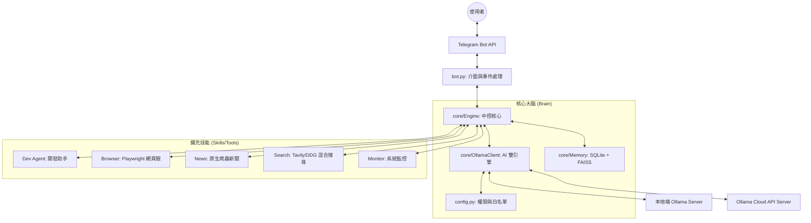

# 🤖 Telegram-to-Control (Ollama Dual Engine)

這是一個進化版的 Telegram AI Agent 平台，徹底拋棄了舊有的 Gemini CLI。核心完全基於 **Python 與 Ollama (支援 Local 與 Cloud API)**。

這不只是一個聊天機器人，而是一個具備「思考、觀察、工具選擇」能力的 **Autonomous Agent**。

---

## 🏗️ 系統架構圖 (Architecture)



---

## 🧩 核心功能亮點 (Core Features)

### 1. 🌈 靈魂引導流程 (Soul Onboarding)
這是系統最人性化的設計。當您第一次啟動 Bot 時，Agent 會主動向您發起「靈魂初始化問卷」，詢問您的個性偏好、互動規範與稱呼方式。這讓您的 AI 助理從第一秒起就真正「認主」。

### 2. 🎭 個性自定義 (Soul Customization)
透過 `/soul` 指令，您可以隨時調整或洗滌 Agent 的靈魂。您可以讓它是傲嬌的助理、專業的導師，或是機智的脫口秀演員。

### 3. 🧠 記憶蒸餾系統 (Memory Distillation)
為了解決長對話導致的 Token 爆炸問題，系統具備自動化記憶蒸餾功能：
- **自動總結**：對話超過 20 輪時，自動聚合舊歷史為「Session Summary」。
- **滾動清理**：刪除冗長舊訊息，只保留精華摘要注入系統提示，平衡 Token 消耗與記憶深度。

### 4. 🌐 混合搜尋引擎 (Advanced Web Search)
系統內建了強大的網頁搜尋技能。支援設定 `TAVILY_API_KEY` 來啟用**頂級的 Tavily AI 大神搜尋**，這能繞過區域限制與防爬蟲機制，精準抓取最新資訊。若未設定，系統依然能平滑回退，自動使用輕量且快速的 `DuckDuckGo (DDGS)` 進行搜索。

### 5. 🛡️ 執行安全與防幻覺 (Safety & Truthfulness)
內建 ReAct 思考規範。Agent 在呼叫工具前會進行內部推理，如果不確定事實或缺乏上下文，會選擇承認「我不知道」而不是編造虛假指令，確保執行安全。

### 6. 🚀 Ollama 雙引擎 (Dual Engine)
支援本地運算的 Ollama 與雲端的 Ollama Cloud API。透過 `agent config` 即可一鍵切換與配置模型白名單。

---

## 🧩 各元件技術解析

- **`Engine` (core/__init__.py)**: 實作了雙層路由機制（Function Calling + Text Path），協調各項技能。
- **`Memory` (core/memory.py)**: 整合 SQLite（持久化設定）與 FAISS（語義檢索）。
- **`OllamaClient` (core/ollama_client.py)**: 統一封裝 OpenAI 相容 API，支援串流輸出。

---

## ⚡ 快速開始 (Quick Start)

### 1️⃣ 初始化環境
```bash
bash setup.sh
```

### 2️⃣ 互動式配置
```bash
./agent config
```

### 3️⃣ 啟動
```bash
./agent start
```

---

## 📱 管理工具 (`./agent`)
- `./agent start / stop / restart`: 服務管理。
- `./agent config`: 模型與環境配置。
- `./agent status`: 狀態檢查。
- `./agent logs`: 查看日誌。

---

## 📄 License
MIT
