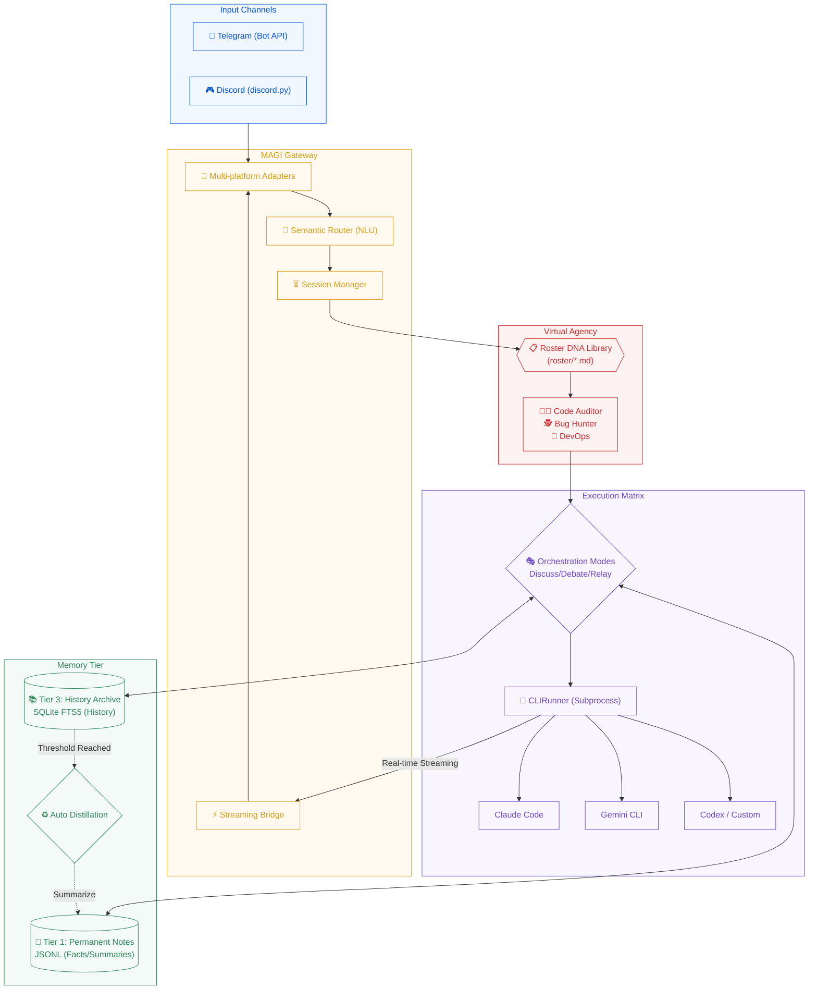

# mini_agent_team (Project MAGI)

**The Pocket AI Software Company** — Bridge powerful local CLI agents (Claude Code, Gemini CLI, Codex, etc.) to Telegram and Discord. Featuring a "Virtual Agency" architecture, dual-tier persistent memory, and automated distillation.

> 繁體中文說明請見 [README.zh-TW.md](README.zh-TW.md)

---

## Architecture (Project MAGI)



---

## Key Features

- **Multi-Platform Support**: Seamlessly integrate Telegram and Discord within a single process.
- **Virtual Agency Architecture**: Define expert "Job DNA" in `roster/*.md`; the system routes requests to the best-fit specialist automatically.
- **Multi-Agent Orchestration**: Native support for **Discuss**, **Debate**, and **Relay** modes for collaborative AI workflows.
- **Memory Distillation**: Automatically summarizes long conversations into Tier 1 facts to keep context clean and relevant.
- **Real-time Streaming**: Enjoy live message updates as the AI generates output via the Streaming Bridge.
- **Advanced Persistent Memory**: Dual-tier storage featuring permanent facts (Tier 1) and searchable conversation history (Tier 3).

---

## Quick Start

### Prerequisites
- **Python 3.11+**
- **CLI Agents**: Install at least one: `claude` (Claude Code), `gemini` (Gemini CLI), or `codex`.
- **Tokens**: A Telegram and/or Discord Bot Token.

### Installation

#### 1. Automatic Installation (One-liner)
```bash
curl -fsSL https://raw.githubusercontent.com/nchiyi/mini_agent_team/main/install.sh | bash
```

#### 2. Manual Installation
```bash
# Clone the repository
git clone https://github.com/nchiyi/mini_agent_team.git
cd mini_agent_team

# Create virtual environment
python3 -m venv venv && source venv/bin/activate

# Install dependencies
pip install -r requirements.txt

# Run the setup wizard
python3 -m src.setup.wizard
```

### Execution
```bash
python3 main.py
```

---

## Configuration

### `secrets/.env`
```env
TELEGRAM_BOT_TOKEN=your_token
DISCORD_BOT_TOKEN=your_token (optional)
ALLOWED_USER_IDS=123456789,987654321  # Mandatory: Locks the bot
```

### `config/config.toml` (Key Parameters)
```toml
[gateway]
default_runner = "claude"
session_idle_minutes = 60
stream_edit_interval_seconds = 1.5

[runners.claude]
path = "claude"
args = ["--dangerously-skip-permissions"]
timeout_seconds = 300
context_token_budget = 4000

[runners.codex]
path = "codex"
args = ["exec", "--full-auto", "--skip-git-repo-check"]
timeout_seconds = 300
context_token_budget = 4000

[runners.gemini]
path = "gemini"
args = ["--approval-mode", "yolo"]
timeout_seconds = 300
context_token_budget = 4000


[memory]
db_path = "data/db/history.db"
distill_trigger_turns = 20  # Automatic summary after N turns
```

---

## Bot Commands

| Category | Command | Description |
|----------|---------|-------------|
| **Agent** | `/claude`, `/gemini` | Switch the active AI runner |
| | `/use <role>` | Switch to a specific Roster specialist |
| **Modes** | `/discuss <r1,r2> [p]` | Multi-agent brainstorming session |
| | `/debate <r1,r2> [p]` | Comparative debate between agents |
| **Memory** | `/remember <text>` | Save a permanent fact (Tier 1) |
| | `/recall <query>` | Full-text search of history (Tier 3) |
| **System** | `/status`, `/usage` | Check system health and token stats |
| | `/new`, `/cancel` | Reset session or stop generation |

---

## Project Structure

```text
mini_agent_team/
├── main.py                # Core entry point
├── roster/                # Expert Role DNA definitions (.md)
├── src/
│   ├── channels/          # TG/DC Adapters
│   ├── gateway/           # Routing, Session & Streaming bridge
│   ├── core/memory/       # Dual-tier storage & distillation
│   ├── runners/           # CLI Subprocess wrappers
│   └── agent_team/        # Orchestration logic
├── modules/               # Plugin directory (Web Search, Vision)
├── data/                  # Runtime data (Database, Logs)
└── config/                # System config & scripts
```

---

## Security & Policy

- **Privacy Isolation**: Memory is strictly isolated by `(user_id, channel)`.
- **Fail-Closed**: `ALLOWED_USER_IDS` is mandatory to prevent unauthorized access.
- **Usage Policy**: This platform is for personal remote control only. Sharing licensed CLI tools with third parties via this gateway is prohibited.

---

## License
MIT License
