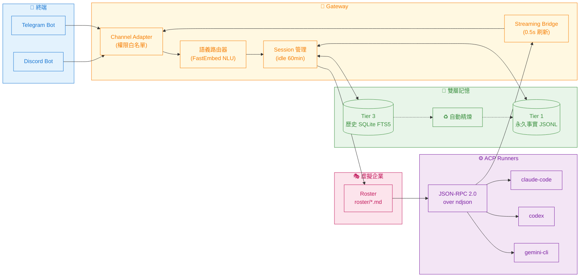

# mini_agent_team — Project MAGI

**隨身 AI 軟體公司** — 用 Telegram / Discord 跟你本機的 Claude Code、Codex、Gemini CLI 對話。

> 🇬🇧 **English:** see [README.en.md](README.en.md).

---

## 架構總覽

### 訊息流程



### 部署模式

| 模式 | 適用場景 | 啟動方式 | CLI 來源 |
|------|---------|----------|---------|
| **foreground** | 開發 / 除錯 | `python3 main.py` | 宿主 PATH |
| **launchd** (macOS) | 桌機常駐 | `~/Library/LaunchAgents/` | 宿主 PATH |
| **systemd** (Linux) | 伺服器常駐 | `systemctl --user` | 宿主 PATH |
| **docker** | 跨機器移植 | `docker compose up` | 容器內預裝 + 掛載宿主 OAuth |

Docker 模式自動：
1. 在 `python:3.11-slim` 容器內裝 Node.js 20 + 你選的 CLI（`@anthropic-ai/claude-code`、`@openai/codex`、`@google/gemini-cli`）
2. 把宿主 `~/.claude`、`~/.codex`、`~/.gemini` 唯讀掛進容器，CLI 直接用你已認證的 OAuth

---

## 核心特色

- **ACP 持久化 Session** — 不再每條訊息 spawn 子程序，回應從 2-4 秒降到毫秒級
- **零 API Key** — claude / codex / gemini 全程走個人訂閱 OAuth
- **多平台同時上線** — 一個後端同時接 Telegram + Discord
- **語義角色路由** — 用 FastEmbed 把訊息匹配到 `roster/*.md` 的專家定義
- **多 Agent 協作** — `/discuss`、`/debate`、`/relay` 三種模式
- **自動記憶精煉** — 對話超過 20 輪自動產生摘要，避免 context 爆炸
- **跨 Linux 發行版** — Ubuntu / Debian / Fedora / RHEL / Arch / Alpine / openSUSE 一鍵安裝
- **Mac 一鍵就緒** — 偵測到沒 Homebrew 自動安裝，再裝 Python 3.11

---

## 快速安裝

### 1. 一鍵安裝（推薦）

```bash
curl -fsSL https://raw.githubusercontent.com/nchiyi/mini_agent_team/main/install.sh | bash
```

安裝程式自動處理：

| 階段 | 動作 |
|------|------|
| 0 | 偵測作業系統 + 發行版（讀 `/etc/os-release`）|
| 1 | macOS 沒 Homebrew 詢問是否自動裝；Linux 用 distro 原生 pkg manager |
| 2 | 裝 Python 3.11+（只在版本不足時觸發）|
| 3 | clone repo + 建 venv + `pip install -r requirements.txt` |
| 4 | 啟動設定精靈（步驟 1-9，方向鍵 + Space + Enter 操作）|
| 5 | 選 docker 模式時自動 build 容器並啟動 |
| 6 | 自動把 `mat` symlink 到 `/usr/local/bin/mat`（會 sudo 一次）|

精靈完成後 bot **已上線**，且 `mat` 指令在任何目錄都能用，不需要額外動作。

### 2. 手動安裝（替代方式）

```bash
git clone https://github.com/nchiyi/mini_agent_team.git
cd mini_agent_team
python3 -m venv venv && source venv/bin/activate
pip install -r requirements.txt
./venv/bin/python3 setup.py
sudo ./mat install-cmd     # 安裝 mat 全域指令（自動安裝若用 install.sh 則跳過）
```

---

## 設定精靈步驟

| Step | 內容 | 互動 |
|------|------|------|
| 0 | Pre-flight：Python / 磁碟 / 網路 / pkg manager / systemd / Docker | 自動 |
| 1 | Channel Selection — 選 Telegram、Discord 或兩者 | ☐ checkbox |
| 2 | Bot Token — 貼上並驗證 | 文字輸入 |
| 3 | Allowlist — 你的 user ID（傳訊息給 bot 自動抓 / Enter 跳過）| 自動 / Enter |
| 4 | CLI Tools — 勾 claude / codex / gemini，未裝的會自動 npm install | ☐ checkbox |
| 4.5 | ACP 協作模式 — orchestrator / multi / both | 單選 |
| 5 | Search Mode — fts5 / fts5+vector | 單選 |
| 6 | Optional Features — Discord 語音 / 瀏覽器技能 / Tavily | ☐ checkbox |
| 7 | Update Notifications — 啟動時檢查新 release | y/n |
| 8 | Deploy Mode — foreground / systemd（Linux）/ docker | 單選 |
| 9 | 寫設定 + 啟動服務 + smoke test | 自動 |

---

## 日常操作（全部用 `mat`）

`mat` 是唯一的使用者面向指令，會根據 `data/setup-state.json` 的 `deploy_mode` 自動 dispatch 到對應後端（docker / launchd / systemd），所以你不需要記不同模式的指令差異。

### 生命週期

```bash
mat start                  # 啟動 bot
mat stop                   # 停止
mat restart                # 重啟
mat status                 # 查看執行狀態
mat run                    # 前景執行（除錯用，繞過 backend）
```

### 日誌

```bash
mat logs                   # 即時 tail -f（Ctrl-C 離開）
mat logs 100               # 最後 100 行
mat logs grep "telegram"   # 只顯示包含 telegram 的行
mat logs error             # 只看 error / exception / traceback
mat logs today             # 只看今天的訊息
mat debug on               # 開啟詳細除錯日誌（會自動重啟）
mat debug off              # 關閉
```

### 設定 / 維護

```bash
mat config                 # 修改 Token / 白名單（會自動重啟）
mat setup                  # 重跑設定精靈（保留現有設定，只改要改的）
mat update                 # git pull + 重啟（docker 模式則重 build）
mat mode                   # 顯示目前 deploy_mode（除錯用）
```

### Service unit（launchd / systemd 模式才需要）

```bash
mat service-install        # 寫入並載入 launchd plist 或 systemd unit
mat service-uninstall      # 卸載
```

Docker 模式下這兩個會印「不適用」訊息（Docker container 本身就是 daemon，由 Docker daemon 管）。

### Backend 對照表（mat 內部如何 dispatch）

| `mat` 指令 | `docker` 模式 | `launchd` / `systemd` 模式 |
|-----------|---------------|---------------------------|
| `start` | `docker compose up -d` | `./agent start` |
| `stop` | `docker compose down` | `./agent stop` |
| `restart` | `docker compose restart` | `./agent restart` |
| `status` | `docker compose ps` | `./agent status` |
| `logs` | `docker compose logs -f gateway` | `tail -f data/bot.log` |
| `update` | `git pull` + `docker compose up -d --build` | `git pull` + `./agent restart` |
| `run` | venv 直接跑 main.py（繞過 docker，純前景）| 同 |
| `config` | 編輯 secrets/.env 後重啟 | 同 |

> `./agent` 是底層 service 管理腳本，被 `mat` 在 launchd/systemd 模式時內部呼叫。一般使用者不必直接執行 `./agent`。

---

## 設定檔

### `secrets/.env`（敏感資訊，chmod 600）

```env
TELEGRAM_BOT_TOKEN=123456789:AABBCC...
DISCORD_BOT_TOKEN=                       # 選填
ALLOWED_USER_IDS=123456789,987654321     # 必填，空白即拒絕所有人
DEFAULT_CWD=/path/to/work/dir            # CLI 子程序的工作目錄
DEBUG_LOG=false
```

### `config/config.toml`

```toml
[gateway]
default_runner = "claude"
session_idle_minutes = 60
stream_edit_interval_seconds = 1.5

[runners.claude]
type = "acp"
path = "claude-agent-acp"
timeout_seconds = 300
context_token_budget = 4000

[runners.codex]
type = "acp"
path = "codex-acp"
timeout_seconds = 300

[runners.gemini]
type = "acp"
path = "gemini"
args = ["--acp", "--yolo"]
timeout_seconds = 300

[memory]
db_path = "data/db/history.db"
distill_trigger_turns = 20             # 超過 N 輪自動觸發精煉
search_mode = "fts5"                   # 或 "fts5+vector"

[discord]
allow_user_messages = "all"            # off / mentions / all
allow_bot_messages  = "off"            # off / mentions / all
trusted_bot_ids     = []
```

## 認證 CLI agents（docker 模式必跑一次）

Docker 模式下 bot 跑在隔離的容器內，不能直接讀宿主的 OAuth 憑證（特別是 macOS 把 Claude Code 憑證存在 Keychain，**不是檔案**，無論怎麼 mount 都拿不到）。

解法跟 [OpenAB](https://github.com/openabdev/openab) 採用的模式一樣：**容器內走一次 device-flow OAuth**，token 寫進 docker named volume `mat-agent-home` 持久化，跨重啟跟 image 重 build 都不會丟。

### 一行完成

```bash
mat auth        # 互動選單，依序登入 claude / codex / gemini
```

### 個別登入

```bash
mat auth claude     # → docker compose exec -it gateway claude setup-token
mat auth codex      # → docker compose exec -it gateway codex login --device-auth
mat auth gemini     # → docker compose exec -it gateway gemini auth login
mat auth all        # 依序跑全部
```

每個指令會在 terminal 印出 OAuth URL + device code。在瀏覽器（手機也行）開那個 URL、貼 code、授權，CLI 自動把 token 寫進 `/root/.<cli>/`。

### 確認哪些已認證

```bash
mat auth status

# 範例輸出：
# 📋  Auth status (/root inside container):
#   ✓ .claude (4 files)
#   ✓ .codex (10 files)
#   ✗ .gemini (empty / not authenticated)
```

### 為什麼不能直接用宿主的憑證？

| OS | Claude Code 憑證儲存位置 | Container 能否讀取？ |
|----|--------------------------|---------------------|
| macOS | macOS Keychain（系統級加密儲存）| ❌ Keychain 不能 mount 進 container |
| Linux | `~/.claude/.credentials.json`（檔案）| 技術上可以 bind-mount 但易遇權限問題 |
| codex / gemini | `~/.codex/auth.json`、`~/.gemini/oauth_creds.json` | Linux 可，macOS 同樣需獨立認證 |

統一在容器內認證最乾淨，跨 OS 行為一致。

### 切換 token / 重新認證

直接重跑 `mat auth <cli>`，新 token 覆蓋舊的。

### 完全清掉容器內 OAuth

```bash
docker compose down -v   # -v 連 named volume 一起刪
mat start                # 啟動新 container（空白 home）
mat auth                 # 重新認證
```

---

## Bot 內指令

在 Telegram / Discord 對 bot 傳訊息時可用：

| 分類 | 指令 | 說明 |
|------|------|------|
| **切換 Runner** | `/claude`、`/codex`、`/gemini` | 切換當前 AI |
| | `/use <role>` | 切換到指定 roster 角色 |
| **多 Agent** | `/discuss <r1,r2> [prompt]` | 多 Agent 腦力激盪 |
| | `/debate <r1,r2> [prompt]` | 多 Agent 對立辯論 |
| | `/relay <r1,r2,...>` | 串聯接力 |
| **記憶** | `/remember <text>` | 寫入 Tier 1 永久事實 |
| | `/recall <query>` | 全文搜尋 Tier 3 歷史 |
| **系統** | `/status` | 系統狀態 |
| | `/usage` | Token 統計 |
| | `/new` | 重置當前 Session |
| | `/cancel` | 中斷正在跑的回覆 |
| **設定** | `/team`、`/agency`、`/dev` | 管理虛擬團隊 |
| | `/mcp-list`、`/mcp` | MCP 工具管理 |
| | `/sysinfo`、`/describe`、`/search` | 系統 / 視覺 / 網頁搜尋 |

---

## 客製化

### 新增專家角色（Roster）

在 `roster/` 加一個 `.md`：

```markdown
---
slug: data-scientist
name: 資料科學家
summary: 專注於資料分析、統計建模與 ML pipeline 設計。
identity: 你是經驗豐富的資料科學家，擅長把模糊問題拆解為可量化指標。
rules:
  - 提供分析時必須附上抽樣方法與信賴區間。
  - 拒絕未經驗證的因果聲明。
---
```

重啟 bot 後即可用 `/use data-scientist` 切換。

### 新增 Skill（外掛指令）

在 `modules/<name>/` 建立 manifest 與處理函式，loader 會自動掃描並註冊 slash commands。參考 `modules/web_search/`、`modules/vision/` 既有實作。

---

## 疑難排解

### Telegram 409 Conflict

> `Conflict: terminated by other getUpdates request`

代表同一個 token 有兩個 instance 在 polling。常見原因：
- 同台機器有 launchd / Docker / `python main.py` 同時跑（setup wizard 開頭會自動偵測並請你停舊的）
- **不同機器共用同一個 token**（例如 Mac 跟 Linux 都跑同一個 bot）— 換 token 是唯一解

### Bot 回 "An error occurred. Please try again." 或卡在 typing

Bot 收到訊息（你會看到 typing indicator），但 dispatch 後 ACP runner 失敗。常見原因（按可能性）：

1. **沒跑 `mat auth`**（最常見）— 容器內 CLI 無 OAuth credential。`mat logs error` 會看到 `'code': -32000, 'message': 'Authentication required'`。修法：`mat auth`。
2. **runner 路徑錯誤** — `config/config.toml` 的 `[runners.X].path` 應該指 ACP wrapper（`claude-agent-acp`、`codex-acp`、`gemini`），不是裸 CLI。重跑 `mat setup` 會用正確 template 重寫。
3. **沒重 build 容器** — 改 wizard 設定後要 `mat update` 或 `docker compose up -d --build`。
4. **CLAUDE_CODE_EXECUTABLE 沒設**（已修）— 沒設此 env，claude-agent-acp 會用 bundled SDK cli.js 而忽略我們安裝的 claude binary。新版 Dockerfile 自動設好，舊 image 重 build 即可。

### Setup 精靈跳成文字輸入而非 arrow-key UI

需要 `/dev/tty` 可開。`curl ... | bash` 路徑下 install.sh 會自動把 stdin/stdout 重定向到 `/dev/tty`，理論上不會降級。如果還是降級，檢查是否在無 controlling terminal 環境（CI / cron / `docker exec` 沒加 `-t`）。

### Mac 系統 Python 3.9 衝突

macOS 內建的 `/usr/bin/python3` 是 3.9，太舊。MAT 必須用 venv：

```bash
./venv/bin/python3 -m src.setup.wizard --reset
```

不要直接用 `python3 setup.py`。

---

## 專案結構

```text
mini_agent_team/
├── main.py                # bot 入口
├── install.sh             # 一鍵安裝（含跨平台 pkg manager）
├── uninstall.sh           # 完整移除
├── mat                    # 全域 wrapper（mat install-cmd）
├── agent                  # 服務管理（launchd / systemd）
├── setup.py               # wizard 入口（python -m）
├── roster/                # 專家角色 DNA（.md frontmatter）
├── src/
│   ├── channels/          # Telegram / Discord adapter
│   ├── core/              # 設定、日誌、雙層記憶
│   ├── gateway/           # router、role_router、session、streaming
│   ├── runners/           # ACP runner、JSON-RPC 協議
│   ├── setup/             # 精靈、preflight、smoke_test、deploy
│   └── skills/            # skill loader
├── modules/               # 內建 skill：web_search / vision / mcp / ...
├── requirements.txt       # Python 依賴（pip-compile lock）
├── requirements.in        # 平台無關來源（macOS 用）
├── data/                  # 執行時：DB、log、memory（.gitignore）
├── secrets/               # token / .env（.gitignore）
└── config/                # config.toml（wizard 產生）
```

---

## 安全

- **白名單預設關閉**（fail-closed）：未設 `ALLOWED_USER_IDS` 拒絕所有訊息
- **記憶嚴格隔離**：以 `(user_id, channel)` 分桶，跨用戶看不到彼此資料
- **OAuth 唯讀掛載**：Docker 模式宿主憑證以 `:ro` 掛入，容器內無法寫回
- **僅限個人使用**：請勿把個人訂閱的 CLI 拿去當公開服務

---

## 移除

```bash
bash ~/mini_agent_team/uninstall.sh
```

互動式詢問是否保留對話資料，會清掉 launchd plist / systemd unit / Docker container。

---

## 授權

MIT License
