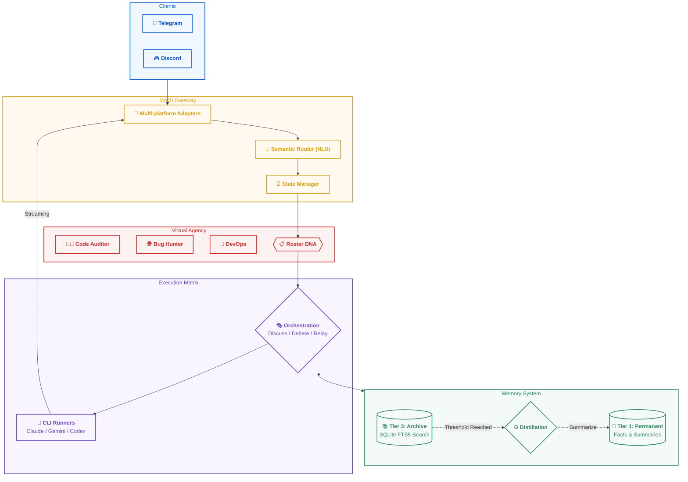

# mini_agent_team (Project MAGI)

**The Pocket AI Software Company** — Bridge powerful local CLI agents (Claude Code, Gemini CLI, etc.) to Telegram and Discord. Featuring a "Virtual Agency" architecture, dual-tier persistent memory, and automated distillation.

> 繁體中文說明請見 [README.zh-TW.md](README.zh-TW.md)

---

## Architecture (Project MAGI)



---

## Key Features

### 🏛️ Virtual Agency Architecture
More than just a chatbot — build an expert team with specific "Job DNA". Define mission and rules in `roster/*.md`, and the system will automatically route your natural language requests (e.g., "Audit this code for security") to the most suitable role (e.g., `code-auditor`).

### 🧠 Memory Distillation
Solve the "context explosion" problem. When conversation history grows too long, the system automatically summarizes older turns into permanent facts (Tier 1), ensuring the AI remembers key decisions without bloating the prompt.

### 🎭 Multi-Agent Orchestration
Built-in **Discuss**, **Debate**, and **Relay** modes. Let Claude and Gemini debate an architectural decision to provide you with balanced, high-fidelity development advice.

### ⚡ Extreme Streaming
Powered by our custom Streaming Bridge, you can see real-time progress from CLI tools and long code generations instantly on your mobile device, reducing latency and improving interactivity.

---

## Quick Start

### Prerequisites
- Python 3.12+
- At least one CLI Agent installed: `claude` (Claude Code) or `gemini` (Gemini CLI).
- Telegram and/or Discord Bot Token.

### One-liner Installation (Recommended)
```bash
curl -fsSL https://raw.githubusercontent.com/nchiyi/mini_agent_team/main/install.sh | bash
```

---

## Command Encyclopedia

| Category | Command | Description |
|----------|---------|-------------|
| **Expert System** | `/claude`, `/gemini` | Call a specific AI runner directly |
| | `/use <slug>` | Manually switch to a specific Roster role |
| **Collaboration** | `/discuss <r1,r2> [p]` | Multi-agent brainstorming session |
| | `/debate <r1,r2> [p]` | Comparative debate between agents |
| | `/relay <r1,r2> [p]` | Sequential agent pipeline |
| **Memory** | `/remember <text>` | Save a permanent fact (Tier 1) |
| | `/recall <query>` | Full-text search of history (Tier 3) |
| **System** | `/status`, `/usage` | Check system health and token stats |
| | `/new` or `/reset` | Reset current session and context |
| | `/cancel` | Immediately stop AI generation |
| | `/voice on/off` | Toggle speech-to-text functionality |

---

## Project Structure

```text
mini_agent_team/
├── main.py                # Core entry point (The Brain)
├── roster/                # Expert Role DNA definitions
├── src/
│   ├── gateway/           # NLU & Semantic routing core
│   ├── core/memory/       # Dual-tier storage & distillation
│   ├── agent_team/        # Orchestration logic
│   └── runners/           # Async CLI monitoring
├── modules/               # Plugins (Web Search, Vision)
└── config/                # System config & deployment scripts
```

---

## Security & Policy

- **Privacy First**: Memory is strictly isolated by `(user_id, channel)`.
- **Fail-Closed**: `ALLOWED_USER_IDS` is mandatory; empty list locks the bot.
- **Policy**: This platform is for personal remote control only. Multi-user proxying of licensed CLI tools like Claude Code is strictly prohibited.

---

## License

MIT License
