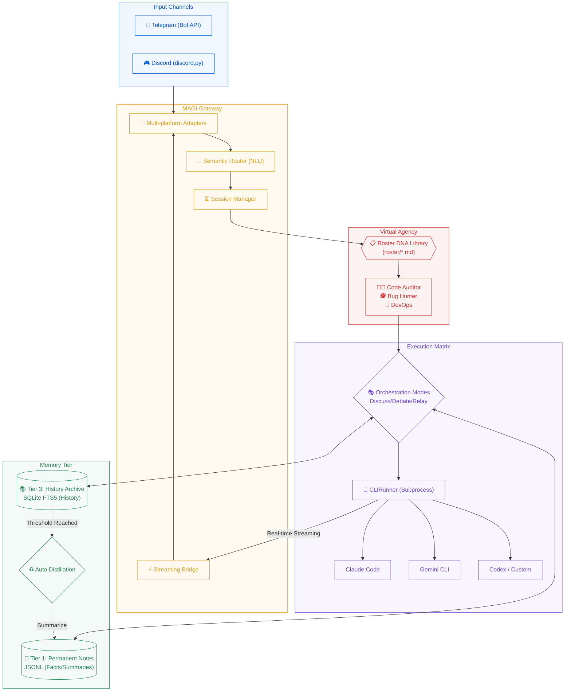

# mini_agent_team (Project MAGI)

**The Pocket AI Software Company** — Bridge powerful local CLI agents (Claude Code, Gemini CLI, Codex, etc.) to Telegram and Discord. Featuring a "Virtual Agency" architecture, dual-tier persistent memory, and automated distillation.

> 繁體中文說明請見 [README.zh-TW.md](README.zh-TW.md)

---

## Architecture (Project MAGI)



---

## Key Features

- **Multi-Platform Support**: Seamlessly integrate Telegram and Discord within a single process.
- **Virtual Agency Architecture**: Define expert "Job DNA" in `roster/*.md`; the system routes requests to the best-fit specialist automatically.
- **Multi-Agent Orchestration**: Native support for **Discuss**, **Debate**, and **Relay** modes for collaborative AI workflows.
- **Memory Distillation**: Automatically summarizes long conversations into Tier 1 facts to keep context clean and relevant.
- **Real-time Streaming**: Enjoy live message updates as the AI generates output via the Streaming Bridge.
- **Advanced Persistent Memory**: Dual-tier storage featuring permanent facts (Tier 1) and searchable conversation history (Tier 3).

---

## Quick Start

### Prerequisites

- **Git**
- **CLI Agents**: Install at least one: `claude` (Claude Code), `gemini` (Gemini CLI), or `codex`.
- **Tokens**: A Telegram and/or Discord Bot Token.
- **Python 3.11+**: Required to run. If you have an older version, the installer will offer to upgrade automatically.

### One-liner Install

```bash
curl -fsSL https://raw.githubusercontent.com/nchiyi/mini_agent_team/main/install.sh | bash
```

The installer handles everything end-to-end:

1. **Clones** (or updates) the repository
2. **Checks Python** — if < 3.11, offers to auto-install via `deadsnakes` PPA (Ubuntu) or `brew` (macOS)
3. **Creates a virtual environment** and installs dependencies
4. **Launches the setup wizard** (8 guided steps):
   - Channel selection (Telegram / Discord / Both)
   - Bot token input & validation
   - Allowlist — captures your Telegram user ID automatically
   - CLI tools selection (claude, codex, gemini, kiro)
   - Search mode (FTS5 keyword or FTS5 + embeddings)
   - Update notifications
   - Deploy mode (foreground / systemd / docker)
   - Writes config, starts the bot

When the wizard finishes the bot is **already running** — no extra commands needed.

### Manual Install

```bash
git clone https://github.com/nchiyi/mini_agent_team.git
cd mini_agent_team
python3 -m venv venv && source venv/bin/activate
pip install -r requirements.txt
python3 -m src.setup.wizard
```

---

## Managing the Bot

### Foreground mode
The bot runs directly in your terminal. Press `Ctrl-C` to stop.

### Systemd mode
```bash
systemctl --user status  gateway-agent   # status
systemctl --user stop    gateway-agent   # stop
systemctl --user restart gateway-agent   # restart
journalctl --user -u gateway-agent -f    # live logs
```

### Docker mode
```bash
docker compose ps        # status
docker compose logs -f   # live logs
docker compose down      # stop
```

---

## Uninstall

```bash
bash ~/mini_agent_team/uninstall.sh
```

The uninstaller will:
- Stop and remove the systemd service (if configured)
- Stop the Docker container (if running)
- Ask whether to **keep or delete** your conversation data
- Remove the project directory

---

## Configuration

### `secrets/.env`
```env
TELEGRAM_BOT_TOKEN=your_token
DISCORD_BOT_TOKEN=your_token   # optional
ALLOWED_USER_IDS=123456789,987654321  # required — locks the bot to these IDs
```

### `config/config.toml` (Key Parameters)
```toml
[gateway]
default_runner = "claude"
session_idle_minutes = 60
stream_edit_interval_seconds = 1.5

[runners.claude]
path = "claude"
args = ["--dangerously-skip-permissions"]
timeout_seconds = 300
context_token_budget = 4000

[runners.codex]
path = "codex"
args = ["exec", "--full-auto", "--skip-git-repo-check"]
timeout_seconds = 300
context_token_budget = 4000

[runners.gemini]
path = "gemini"
args = ["--approval-mode", "yolo"]
timeout_seconds = 300
context_token_budget = 4000

[memory]
db_path = "data/db/history.db"
distill_trigger_turns = 20  # auto-summarize after N turns
```

---

## Bot Commands

| Category | Command | Description |
|----------|---------|-------------|
| **Agent** | `/claude`, `/gemini` | Switch the active AI runner |
| | `/use <role>` | Switch to a specific Roster specialist |
| **Modes** | `/discuss <r1,r2> [p]` | Multi-agent brainstorming session |
| | `/debate <r1,r2> [p]` | Comparative debate between agents |
| **Memory** | `/remember <text>` | Save a permanent fact (Tier 1) |
| | `/recall <query>` | Full-text search of history (Tier 3) |
| **System** | `/status`, `/usage` | Check system health and token stats |
| | `/new`, `/cancel` | Reset session or stop generation |

---

## Project Structure

```text
mini_agent_team/
├── main.py                # Core entry point
├── install.sh             # One-liner installer
├── uninstall.sh           # Full uninstaller
├── roster/                # Expert Role DNA definitions (.md)
├── src/
│   ├── channels/          # TG/DC Adapters
│   ├── gateway/           # Routing, Session & Streaming bridge
│   ├── core/memory/       # Dual-tier storage & distillation
│   ├── runners/           # CLI Subprocess wrappers
│   ├── setup/             # Setup wizard & deploy helpers
│   └── agent_team/        # Orchestration logic
├── modules/               # Plugin directory (Web Search, Vision)
├── data/                  # Runtime data (Database, Logs)
└── config/                # System config
```

---

## Security & Policy

- **Privacy Isolation**: Memory is strictly isolated by `(user_id, channel)`.
- **Fail-Closed**: `ALLOWED_USER_IDS` is mandatory to prevent unauthorized access.
- **Usage Policy**: This platform is for personal remote control only. Sharing licensed CLI tools with third parties via this gateway is prohibited.

---

## License
MIT License
