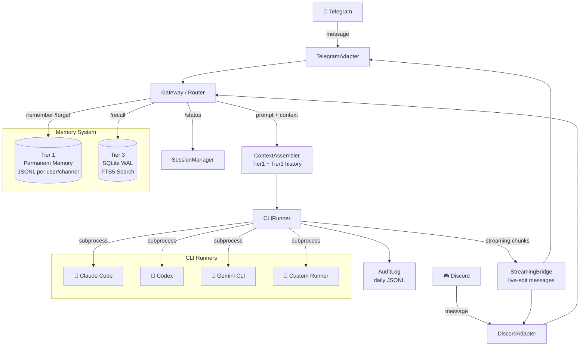

# mini_agent_team

A versatile multi-channel AI gateway that bridges Telegram and Discord to local CLI-based AI agents such as Claude Code, Codex, and Gemini. Interact with your preferred AI agents directly from your mobile device with persistent memory, full-text search capabilities, and a modular plugin architecture.

> 繁體中文說明請見 [README.zh-TW.md](README.zh-TW.md)

---

## Architecture



---

## Key Features

- **Multi-Platform Support**: Seamlessly integrate Telegram and Discord within a single process.
- **Dynamic Agent Switching**: Hot-swap between different AI runners at runtime using commands like `/claude`, `/codex`, or `/gemini`.
- **Real-time Streaming**: Enjoy live message updates as the runner generates output chunks.
- **Advanced Persistent Memory**: Dual-tier storage featuring permanent user notes and searchable conversation history.
- **Modular Plugin System**: Easily extend functionality with drop-in modules for web search, computer vision, and specialized dev agents.
- **Interactive Setup**: Streamlined configuration via a built-in interactive wizard (`python -m src.setup.wizard`).
- **Comprehensive Audit Logs**: Maintain accountability with append-only daily JSONL logs of all runner interactions.

---

## Quick Start

### Prerequisites

- Python 3.11+
- At least one CLI agent installed: `claude`, `codex`, or `gemini`
- A Telegram Bot Token (via [@BotFather](https://t.me/botfather)) and/or a Discord Bot Token.

### Installation

```bash
git clone https://github.com/nchiyi/mini_agent_team.git
cd mini_agent_team
python3 -m venv venv
source venv/bin/activate
pip install -r requirements.txt
```

### Configuration

Launch the interactive setup wizard:

```bash
python3 -m src.setup.wizard
```

Alternatively, configure the environment manually:

```bash
cp config/config.toml.example config/config.toml
cp .env.example secrets/.env
# Update secrets/.env with your tokens and ALLOWED_USER_IDS
```

### Execution

```bash
python3 main.py
```

---

## Detailed Configuration

### `secrets/.env`

```env
TELEGRAM_BOT_TOKEN=your_telegram_token
DISCORD_BOT_TOKEN=your_discord_token      # optional
ALLOWED_USER_IDS=123456789,987654321      # required — leave empty to lock the bot
```

> **Security Note:** The `ALLOWED_USER_IDS` field is mandatory. An empty list will lock the bot, preventing any unauthorized access.

### `config/config.toml`

Key configuration parameters:

```toml
[gateway]
default_runner = "claude"
session_idle_minutes = 60
stream_edit_interval_seconds = 1.5

[runners.claude]
path = "claude"
args = ["--dangerously-skip-permissions"]
timeout_seconds = 300
context_token_budget = 4000

[runners.codex]
path = "codex"
args = ["exec", "-s", "danger-full-access"]
timeout_seconds = 300
context_token_budget = 4000

[runners.gemini]
path = "gemini"
args = []
timeout_seconds = 300
context_token_budget = 4000

[memory]
db_path = "data/db/history.db"
cold_permanent_path = "data/memory/cold/permanent"
tier3_context_turns = 20

[audit]
path = "data/audit"
max_entries = 1000
```

---

## Bot Commands

| Command | Description |
|---------|-------------|
| `/remember <text>` | Save a permanent note to your memory |
| `/forget <keyword>` | Remove permanent notes matching the keyword |
| `/recall <query>` | Perform a full-text search of your conversation history |
| `/status` | View current runner, token usage, and session information |
| `/claude` | Switch to the Claude Code runner |
| `/codex` | Switch to the Codex runner |
| `/gemini` | Switch to the Gemini CLI runner |
| `/new` | Terminate the current session and start fresh |

*All other messages are automatically forwarded to the active runner and streamed back to the user.*

---

## Memory System Architecture

| Tier | Storage Engine | Scope | Purpose |
|------|----------------|-------|---------|
| Tier 1 | Per-user JSONL file | Per user + per channel | High-priority permanent facts saved with `/remember` |
| Tier 3 | SQLite WAL + FTS5 | Per user + per channel | Searchable long-term conversation history |

**Context Injection Order:**
1. Tier 1 permanent notes (up to `tier1_budget` tokens)
2. Most recent Tier 3 turns (up to `tier3_context_turns` turns, token-capped)

Both tiers are scoped per `(user_id, channel)` to prevent cross-platform data leakage.

---

## Module System

Extend the gateway by placing module directories under `modules/`. Each module must contain a `handler.py` that exports an `AsyncGenerator` handler. Modules are automatically discovered during the startup sequence.

### Included Modules

| Module | Description |
|--------|-------------|
| `dev_agent` | Delegates complex coding tasks to a sub-agent with git worktree isolation |
| `web_search` | Real-time web search via DuckDuckGo or Tavily API |
| `vision` | Image description and analysis via multimodal APIs |

---

## Deployment

### Systemd (User Service)

The setup wizard can automatically generate a systemd unit file:

```bash
python3 -m src.setup.wizard
systemctl --user enable --now gateway-agent
systemctl --user status gateway-agent
```

### Docker Compose

```bash
docker compose up -d
docker compose logs -f
```

---

## Project Structure

```
mini_agent_team/
├── main.py                    # Entry point — starts Telegram/Discord adapters
├── requirements.txt
├── config/
│   ├── config.toml            # Generated by wizard
│   └── config.toml.example
├── secrets/
│   └── .env                   # Bot tokens (chmod 600, never commit)
├── data/                      # Runtime data (gitignored)
│   ├── db/history.db          # Tier 3 SQLite database
│   ├── memory/cold/permanent/ # Tier 1 JSONL files
│   └── audit/                 # Daily audit logs
├── modules/                   # Drop-in plugins directory
│   ├── dev_agent/
│   ├── web_search/
│   └── vision/
└── src/
    ├── channels/
    │   ├── base.py            # BaseAdapter interface
    │   ├── telegram.py        # Telegram adapter (python-telegram-bot)
    │   └── discord_adapter.py # Discord adapter (discord.py)
    ├── gateway/
    │   ├── router.py          # Command parsing and routing
    │   ├── session.py         # Per-user session state + idle cleanup
    │   └── streaming.py       # Live-edit streaming bridge
    ├── core/
    │   ├── config.py          # TOML + .env config loader
    │   └── memory/
    │       ├── tier1.py       # Permanent memory (JSONL, sync)
    │       ├── tier3.py       # SQLite history + FTS5 + async write queue
    │       └── context.py     # Token-aware context assembler
    ├── runners/
    │   ├── cli_runner.py      # Async subprocess runner with streaming
    │   └── audit.py           # Async audit logger with file lock
    ├── modules/
    │   └── loader.py          # Module auto-discovery
    ├── agent_team/            # Multi-agent orchestration (planner + executor)
    └── setup/
        ├── wizard.py          # Interactive setup wizard
        ├── deploy.py          # Config / systemd / Docker file writers
        └── installer.py       # CLI tool installer (npm-based)
```

---

## Security

- `ALLOWED_USER_IDS` is **fail-closed**: an empty list locks the bot to all users.
- `secrets/.env` is written with `chmod 600` by the wizard.
- Raw exceptions are never forwarded to chat — only a generic error message is shown.
- Memory is scoped per `(user_id, channel)` — no cross-platform data leakage.
- Discord reply routing uses per-user locks to prevent response misdirection.

---

## License

This project is licensed under the MIT License.
