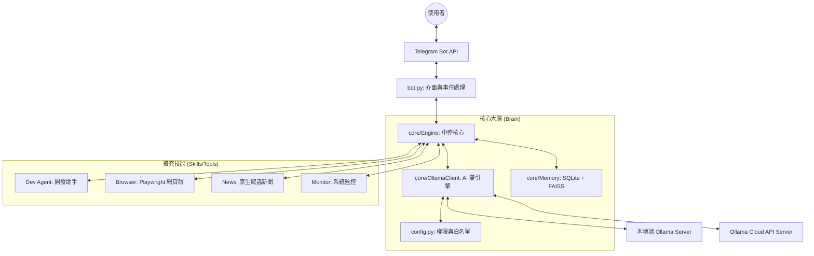

# 🤖 Telegram-to-Control (Ollama Dual Engine)

這是一個進化版的 Telegram AI Agent 平台，徹底拋棄了舊有的 Gemini CLI。核心完全基於 **Python 與 Ollama (支援 Local 與 Cloud API)**。

這不只是一個聊天機器人，而是一個具備「思考、觀察、工具選擇」能力的 **Autonomous Agent**。

---

## 🏗️ 系統架構圖 (Architecture)



---

## 🧩 各元件功能深度解析

### 1. 核心大腦 (Core Engine)
這是系統的神經中樞，負責協調所有元件：
- **`Engine` (core/__init__.py)**: 實作了 **ReAct (Reason + Act)** 流程。它會將使用者的文字傳給 LLM，讓模型決定是要「直接回答」還是「呼叫工具 (Tool Calling)」。
- **`OllamaClient` (core/ollama_client.py)**: 雙模融合層。它會優先檢查 `cloud:` 前綴。如果是雲端請求，會帶上 API Key 往 `api.ollama.com` 發送；否則直接與本機 11434 埠連線。
- **`Memory` (core/memory.py)**: 
    - **SQLite**: 存放長期的對話 Token 統計、用戶設定、專案列表。
    - **Semantic (FAISS)**: 語義向量記憶。它會把過往的重要對話向量化，當你問相似問題時，會自動把「過去的記憶」撈出來當作 Context。

### 2. 交互配置層 (Interactivity)
- **`agent config` (CLI)**: 專為人類設計的交互式選單。它會自動抓取你本地與雲端所有的可用模型，讓你在終端機裡按方向鍵「勾選」你的白名單，並自動寫入 `.env`。
- **`Model Manager` (Skills)**: 讓使用者在手機端用 `/model` 查看自訂的白名單，並即時切換模型，切換結果會持久化到資料庫。

### 3. 特色代理技能 (AI Agents)
- **Dev Agent (`/dev`)**: 具備 OpenAI 格式的對話能力，適合處理開發建議、Code 改寫與除錯。
- **Browser Eye (`/browser`)**: 內建 Playwright。當它覺得需要查資料時，會自動開啟隱藏瀏覽器進行網頁渲染，提取文字回傳給大語言模型。
- **News Fetcher (`/news`)**: 擺脫 Google 聯網限制。採用原生 `urllib` 爬取新聞原始片段，再交由 AI 總結為繁體中文精選日報。

---

## ⚡ 快速開始 (Quick Start)

### 1️⃣ 初始化環境
```bash
git clone https://github.com/nchiyi/telegram-to-control.git
cd telegram-to-control
bash setup.sh
```
此腳本會配置 **Python 虛擬環境 (venv)** 並安裝所有相依套件。

### 2️⃣ 互動式配置 (白名單與 Token)
```bash
./agent config
```
在選單中勾選您想要使用的模型。這會決定 Telegram 裡 `/model list` 顯示的內容。

### 3️⃣ 啟動
```bash
./agent restart
```

---

## 📱 管理工具 (`./agent`)
- `./agent start / stop / restart`: 服務生命週期管理。
- `./agent config`: 配置環境與模型白名單。
- `./agent status`: 查看運行 PID 與連線狀況。
- `./agent logs`: 即時滾動查看運行日誌。

---

## 📄 License
MIT
