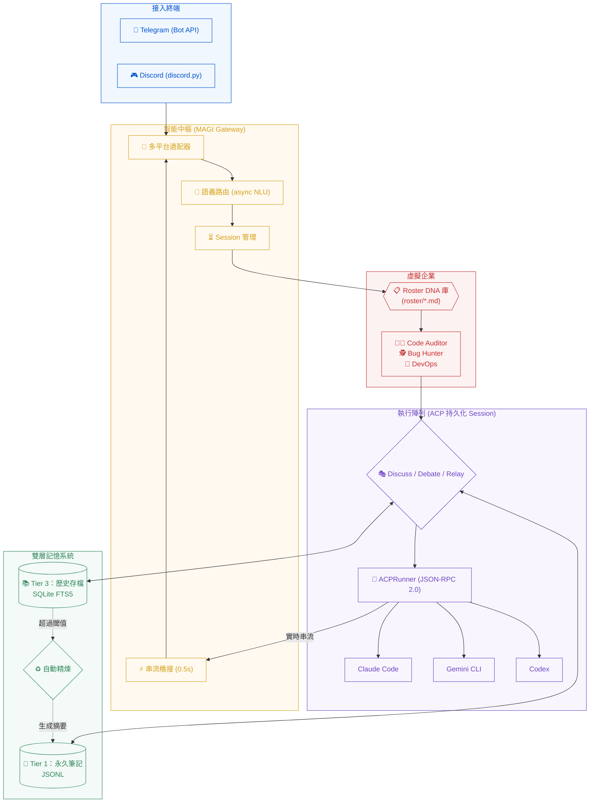

# mini_agent_team (Project MAGI)

**隨身 AI 軟體公司** — 透過 Telegram 與 Discord 連接本地端 CLI Agent（Claude Code、Gemini CLI、Codex）。具備虛擬企業架構、持久化 ACP Session、雙層記憶與自動精煉機制。

> **English:** A personal AI assistant gateway bridging Telegram/Discord to local CLI agents (Claude, Gemini, Codex) via persistent ACP sessions. Zero cold-start, full tool use, OAuth-only auth.
>
> Full English docs: [README.en.md](README.en.md)

---

## 系統架構 (Project MAGI)



---

## 核心亮點

- **零冷啟動延遲**：採用 ACP（Agent Client Protocol）持久化 Session，不再每條訊息重新 spawn 子程序，回應時間從 2–4s 降至毫秒級。
- **完整 Tool Use**：透過 ACP 協議 MAT 自動 approve 所有工具請求（bash、SSH、Web Search、MCP），等同 `--dangerously-skip-permissions` 效果，無需額外設定。
- **OAuth 訂閱授權**：Claude、Codex、Gemini 全程使用個人訂閱 OAuth，不需要任何 API Key。
- **多平台同步**：一個後端同時接通 Telegram 與 Discord。
- **虛擬企業架構 (Virtual Agency)**：透過 `roster/*.md` 定義專家職位 DNA，系統根據語義自動切換專家。
- **多 Agent 協作**：支援 Discuss（討論）、Debate（辯論）與 Relay（串聯）模式。
- **自動記憶精煉 (Distillation)**：自動摘要過長對話，解決 Context Window 爆炸問題。
- **即時串流回覆**：Streaming Bridge 技術，回覆邊生成邊更新（0.5s 刷新）。
- **雙層儲存架構**：Tier 1 永久事實（JSONL）+ Tier 3 可全文檢索歷史（SQLite FTS5）。

---

## 快速開始

### 前置需求

- **Git**
- **CLI Agents**：至少安裝以下其一：`claude`（Claude Code）、`gemini`（Gemini CLI）或 `codex`
- **Tokens**：Telegram Bot Token 和/或 Discord Bot Token
- **Python 3.11+**：執行環境需求
- **Node.js 18+**：ACP runner 套件需求（安裝程式會自動處理）

### 一鍵安裝

```bash
curl -fsSL https://raw.githubusercontent.com/nchiyi/mini_agent_team/main/install.sh | bash
```

安裝程式自動處理以下步驟：

1. Clone（或更新）專案
2. 檢查 Python 版本，若 < 3.11 提示自動升級
3. 建立虛擬環境並安裝所有套件
4. 安裝 ACP npm 套件（`claude-agent-acp`、`codex-acp`）
5. 啟動設定精靈（8 個引導步驟）：
   - 選擇接入頻道（Telegram / Discord / 兩者）
   - 輸入並驗證 Bot Token
   - 設定授權白名單（自動捕捉你的 Telegram 用戶 ID）
   - 選擇 CLI 工具（claude、codex、gemini）
   - 選擇搜尋模式（FTS5 關鍵字 或 FTS5 + 向量嵌入）
   - 選擇部署方式（前景執行 / systemd / Docker）
   - 寫入設定檔並啟動

精靈完成後 Bot **已在執行中**，無需任何額外指令。

### 手動安裝

```bash
git clone https://github.com/nchiyi/mini_agent_team.git
cd mini_agent_team
python3 -m venv venv && source venv/bin/activate
pip install -r requirements.txt
npm install -g @agentclientprotocol/claude-agent-acp @zed-industries/codex-acp
python3 -m src.setup.wizard
```

---

## Bot 管理

### 快速指令（在專案目錄下執行）

```bash
./agent config          # 更新 Bot Token / 授權用戶 ID
./agent restart         # 重啟 Bot
./agent status          # 查看執行狀態
./agent logs            # 即時日誌串流（Ctrl-C 離開）
./agent debug on|off    # 切換詳細日誌模式
```

### 前景模式
Bot 直接在終端機中運行，按 `Ctrl-C` 停止。

### Systemd 模式
```bash
systemctl --user status  gateway-agent
systemctl --user stop    gateway-agent
systemctl --user restart gateway-agent
journalctl --user -u gateway-agent -f
```

### Docker 模式
```bash
docker compose ps
docker compose logs -f
docker compose down
```

---

## 移除安裝

```bash
bash ~/mini_agent_team/uninstall.sh
```

移除程式將停止服務、詢問是否保留對話資料，並刪除整個專案目錄。

---

## 設定說明

### `secrets/.env`
```env
TELEGRAM_BOT_TOKEN=你的Token
DISCORD_BOT_TOKEN=你的Token        # 選填
ALLOWED_USER_IDS=123456789,987654321  # 必填，空白則拒絕所有人
```

### `config/config.toml` 重要參數

```toml
[gateway]
default_runner = "claude"          # 預設 AI Agent
session_idle_minutes = 60          # 閒置幾分鐘後重置 session
stream_edit_interval_seconds = 0.5 # 串流更新間隔（秒）

# ACP 持久化 Runner（不需要 API Key，使用 OAuth 訂閱）
# ACP persistent runners — OAuth subscription only, no API keys required

[runners.claude]
type = "acp"
path = "claude-agent-acp"
args = []
timeout_seconds = 300
context_token_budget = 4000

[runners.codex]
type = "acp"
path = "codex-acp"
args = []
timeout_seconds = 300
context_token_budget = 4000

[runners.gemini]
type = "acp"
path = "gemini"
args = ["--acp", "--yolo"]
timeout_seconds = 300
context_token_budget = 4000

[memory]
db_path = "data/db/history.db"
distill_trigger_turns = 20         # 超過 N 輪自動啟動精煉
```

---

## 指令百科

| 分類 | 指令 | 說明 |
|------|------|------|
| **切換** | `/claude`, `/gemini`, `/codex` | 切換當前 AI Runner |
| | `/use <role>` | 切換至特定專家角色 (Roster) |
| **協作** | `/discuss <r1,r2> [p]` | 多 Agent 腦力激盪 |
| | `/debate <r1,r2> [p]` | 多 Agent 對比辯論 |
| **記憶** | `/remember <text>` | 存入永久事實 (Tier 1) |
| | `/recall <query>` | 全文搜尋歷史對話 (Tier 3) |
| **系統** | `/status`, `/usage` | 查看系統狀態與 Token 統計 |
| | `/new`, `/cancel` | 重置 Session 或中斷輸出 |

---

## 專案結構

```text
mini_agent_team/
├── main.py                # 核心入口
├── install.sh             # 一鍵安裝腳本
├── uninstall.sh           # 完整移除腳本
├── roster/                # 專家角色 DNA 定義庫 (.md)
├── src/
│   ├── channels/          # TG/DC 適配器
│   ├── gateway/           # 語義路由、Session 與串流管理
│   ├── core/memory/       # 雙層記憶 (Tier 1/3) 與精煉邏輯
│   ├── runners/           # ACP Runner 與協議層
│   │   ├── acp_protocol.py   # JSON-RPC 2.0 over ndjson
│   │   └── acp_runner.py     # 持久化 Session 管理
│   ├── setup/             # 設定精靈與部署輔助
│   └── agent_team/        # 多 Agent 協作邏輯
├── modules/               # 擴充外掛（Web Search、Vision）
├── data/                  # 執行時數據（Database、Logs）
└── config/                # 設定檔
```

---

## 安全設計

- **隱私隔離**：記憶以 `(user_id, channel)` 嚴格隔離，防止數據洩漏。
- **權限白名單**：`ALLOWED_USER_IDS` 為強制性設定，預設 fail-closed。
- **使用規範**：本工具僅限作為個人帳號之遠端控制工具，嚴禁將個人授權之 CLI Agent 提供給多人代理使用。

---

## Discord 訊息來源控制

Discord adapter 提供三個獨立旗標，用來控制 Bot 要處理哪些訊息。設定位於 `config/config.toml` 的 `[discord]` 區段。

| 旗標 | 合法值 | 預設值 | 控制對象 |
|------|--------|--------|----------|
| `allow_user_messages` | `off` / `mentions` / `all` | `all` | 一般人類（非 bot）訊息 |
| `allow_bot_messages` | `off` / `mentions` / `all` | `off` | 其他 Discord bot 訊息 |
| `trusted_bot_ids` | bot 的 Discord 用戶 ID 清單 | `[]`（不篩選） | `allow_bot_messages != "off"` 時的 ID 白名單 |

**重點說明**
- 兩個旗標各自獨立判斷，彼此沒有耦合——修改其中一個不會影響另一個。
- `trusted_bot_ids` 只有在 `allow_bot_messages` 為 `"mentions"` 或 `"all"` 時才有效；空清單表示接受所有 bot，非空清單則只放行名單內的 bot ID。
- 人類用戶的授權（`ALLOWED_USER_IDS`）與 `allow_user_messages` 是疊加的，兩者都必須通過。

### 典型場景配置

#### (a) 私人助理 — 僅接受人類訊息
只處理已授權人類的訊息，忽略所有其他 bot。
```toml
[discord]
allow_user_messages = "all"
allow_bot_messages  = "off"
```

#### (b) 多 bot 轉發 — 信任的 bot 清單
接受特定 relay bot 的訊息（同時也服務人類用戶）。
```toml
[discord]
allow_user_messages = "all"
allow_bot_messages  = "all"
trusted_bot_ids     = [123456789012345678, 987654321098765432]
```

#### (c) 公開伺服器 — 僅在被 @mention 時才回應
在熱鬧的伺服器中，只有明確 @提及 Bot 才會觸發回應（人類與 bot 皆適用）。
```toml
[discord]
allow_user_messages = "mentions"
allow_bot_messages  = "mentions"
trusted_bot_ids     = [123456789012345678]
```

---

## License

MIT License
