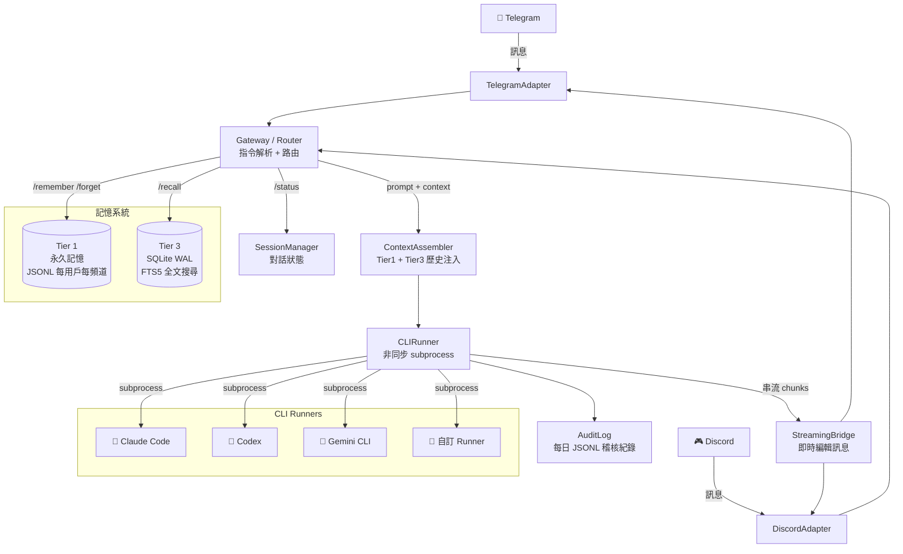

# mini_agent_team

多頻道 AI 閘道平台，透過 Telegram 和 Discord 連接本機 CLI AI Agent（Claude Code、Codex、Gemini 等）。從手機傳訊息，直接呼叫本機的 AI Agent，回覆即時串流、記憶跨對話持久保存。

> English documentation: [README.md](README.md)

---

## 系統架構圖



---

## 功能特色

- **多平台支援**：Telegram + Discord 在同一個 process 同時運行
- **動態切換 Agent**：對話中隨時用 `/claude`、`/codex`、`/gemini` 切換 AI Runner
- **即時串流回覆**：回覆訊息邊生成邊更新，不用等到最後
- **雙層持久記憶**：永久筆記（Tier 1）+ 可搜尋的對話歷史（Tier 3）
- **模組插件系統**：丟一個資料夾進 `modules/` 就能擴充功能
- **互動式安裝精靈**：一鍵設定 `python3 -m src.setup.wizard`
- **稽核日誌**：所有 Runner 呼叫自動記錄到每日 JSONL 檔

---

## 快速開始

### 前置需求

- Python 3.11+
- 至少安裝一個 CLI Agent：`claude`、`codex` 或 `gemini`
- Telegram Bot Token（透過 [@BotFather](https://t.me/botfather)）和/或 Discord Bot Token

### 安裝

```bash
git clone https://github.com/nchiyi/mini_agent_team.git
cd mini_agent_team
python3 -m venv venv
source venv/bin/activate
pip install -r requirements.txt
```

### 設定

執行互動式安裝精靈（推薦）：

```bash
python3 -m src.setup.wizard
```

或手動複製範例檔案：

```bash
cp config/config.toml.example config/config.toml
cp .env.example secrets/.env
# 編輯 secrets/.env，填入 Token 和 ALLOWED_USER_IDS
```

### 啟動

```bash
python3 main.py
```

---

## 設定說明

### `secrets/.env`

```env
TELEGRAM_BOT_TOKEN=你的 Telegram Token
DISCORD_BOT_TOKEN=你的 Discord Token      # 選填
ALLOWED_USER_IDS=123456789,987654321      # 必填，空白則鎖定所有人
```

> **安全提示**：`ALLOWED_USER_IDS` 為必填欄位。留空代表**鎖定 Bot，所有人都無法使用**（不是開放給所有人）。

### `config/config.toml` 重要參數

```toml
[gateway]
default_runner = "claude"          # 預設使用的 AI Agent
session_idle_minutes = 60          # 閒置幾分鐘後重置 session
stream_edit_interval_seconds = 1.5 # 串流更新間隔（秒）

[runners.claude]
path = "claude"
args = ["--dangerously-skip-permissions"]
timeout_seconds = 300
context_token_budget = 4000        # 注入 context 的 token 上限

[runners.codex]
path = "codex"
args = ["exec", "-s", "danger-full-access"]
timeout_seconds = 300
context_token_budget = 4000

[runners.gemini]
path = "gemini"
args = []
timeout_seconds = 300
context_token_budget = 4000

[memory]
db_path = "data/db/history.db"
cold_permanent_path = "data/memory/cold/permanent"
tier3_context_turns = 20           # 每次注入幾輪歷史對話

[audit]
path = "data/audit"
max_entries = 1000
```

---

## Bot 指令

| 指令 | 說明 |
|------|------|
| `/remember <內容>` | 儲存永久筆記到記憶 |
| `/forget <關鍵字>` | 刪除含關鍵字的永久筆記 |
| `/recall <查詢>` | 全文搜尋對話歷史 |
| `/status` | 顯示目前 Runner、Token 用量、Session 資訊 |
| `/claude` | 切換到 Claude Code |
| `/codex` | 切換到 Codex |
| `/gemini` | 切換到 Gemini CLI |
| `/new` | 開始新 Session |

其他所有訊息都會轉發給目前的 Runner，回覆串流回來。

---

## 記憶系統詳解

| 層級 | 儲存方式 | 範圍 | 用途 |
|------|---------|------|------|
| Tier 1 | JSONL 檔案（每用戶每頻道一個） | 永久 | `/remember` 儲存的重要筆記 |
| Tier 3 | SQLite WAL + FTS5 索引 | 長期 | 可搜尋的完整對話歷史 |

**Context 注入順序（每次呼叫 Runner 前）：**
1. Tier 1 永久筆記（最多 `tier1_budget` tokens）
2. 最近 N 輪對話歷史（最多 `tier3_context_turns` 輪，有 token 上限）

兩層記憶都以 `(user_id, channel)` 為 key，Telegram 和 Discord 之間的資料完全隔離。

---

## 串流運作方式

```
Runner 輸出第一個 chunk
    → send() 建立新訊息，取得 message_id
    → 後續 chunks 每隔 edit_interval 秒 edit() 同一則訊息
    → 最終確認送出完整回覆
    → 若回覆超過平台字數限制（Telegram 4096 / Discord 2000）
      → 超出部分用 send() 續傳，不截斷
```

---

## 模組插件系統

在 `modules/` 下新增一個資料夾，裡面放 `handler.py`，export 一個 `AsyncGenerator` handler，啟動時自動載入。

### 內建模組

| 模組 | 說明 |
|------|------|
| `dev_agent` | 複雜程式任務委派給 sub-agent，使用 git worktree 隔離 |
| `web_search` | DuckDuckGo 或 Tavily 即時網路搜尋 |
| `vision` | 圖片描述與分析（多模態 API） |

---

## 部署方式

### systemd（用戶服務，推薦）

安裝精靈會自動生成 systemd unit file：

```bash
python3 -m src.setup.wizard
systemctl --user enable --now gateway-agent
systemctl --user status gateway-agent
journalctl --user -u gateway-agent -f  # 查看 log
```

### Docker Compose

```bash
docker compose up -d
docker compose logs -f
```

---

## 專案結構

```
mini_agent_team/
├── main.py                    # 入口點，啟動 Telegram/Discord adapter
├── requirements.txt
├── config/
│   ├── config.toml            # 由精靈生成
│   └── config.toml.example
├── secrets/
│   └── .env                   # Bot tokens（chmod 600，不 commit）
├── data/                      # 執行時資料（gitignore）
│   ├── db/history.db          # Tier 3 SQLite 資料庫
│   ├── memory/cold/permanent/ # Tier 1 JSONL 檔案
│   └── audit/                 # 每日稽核 log
├── modules/                   # 插件目錄
│   ├── dev_agent/
│   ├── web_search/
│   └── vision/
└── src/
    ├── channels/
    │   ├── base.py            # BaseAdapter 介面
    │   ├── telegram.py        # Telegram adapter（python-telegram-bot）
    │   └── discord_adapter.py # Discord adapter（discord.py）
    ├── gateway/
    │   ├── router.py          # 指令解析 + 路由
    │   ├── session.py         # 用戶 session 狀態 + 閒置清理
    │   └── streaming.py       # 即時串流橋接
    ├── core/
    │   ├── config.py          # TOML + .env 設定載入
    │   └── memory/
    │       ├── tier1.py       # 永久記憶（JSONL，同步）
    │       ├── tier3.py       # SQLite 歷史 + FTS5 + 非同步寫入佇列
    │       └── context.py     # Token-aware context 組裝
    ├── runners/
    │   ├── cli_runner.py      # 非同步 subprocess runner + 串流
    │   └── audit.py           # 非同步稽核 logger（有 asyncio.Lock）
    ├── modules/
    │   └── loader.py          # 模組自動探索
    ├── agent_team/            # 多 Agent 協作（planner + executor）
    └── setup/
        ├── wizard.py          # 互動式安裝精靈
        ├── deploy.py          # 設定檔 / systemd / Docker 寫入器
        └── installer.py       # CLI 工具安裝（npm-based）
```

---

## 安全設計

- `ALLOWED_USER_IDS` **fail-closed**：空白 = 鎖定所有人（而非開放所有人）
- `secrets/.env` 由精靈以 `chmod 600` 寫入，避免他人讀取
- Exception 不轉發給用戶，只回覆通用錯誤訊息，防止洩漏內部資訊
- 記憶以 `(user_id, channel)` 隔離，Telegram 和 Discord 不互相存取
- Discord 回覆路由使用 per-user `asyncio.Lock`，防止同一用戶的回覆傳到錯誤頻道

---

## License

MIT License
