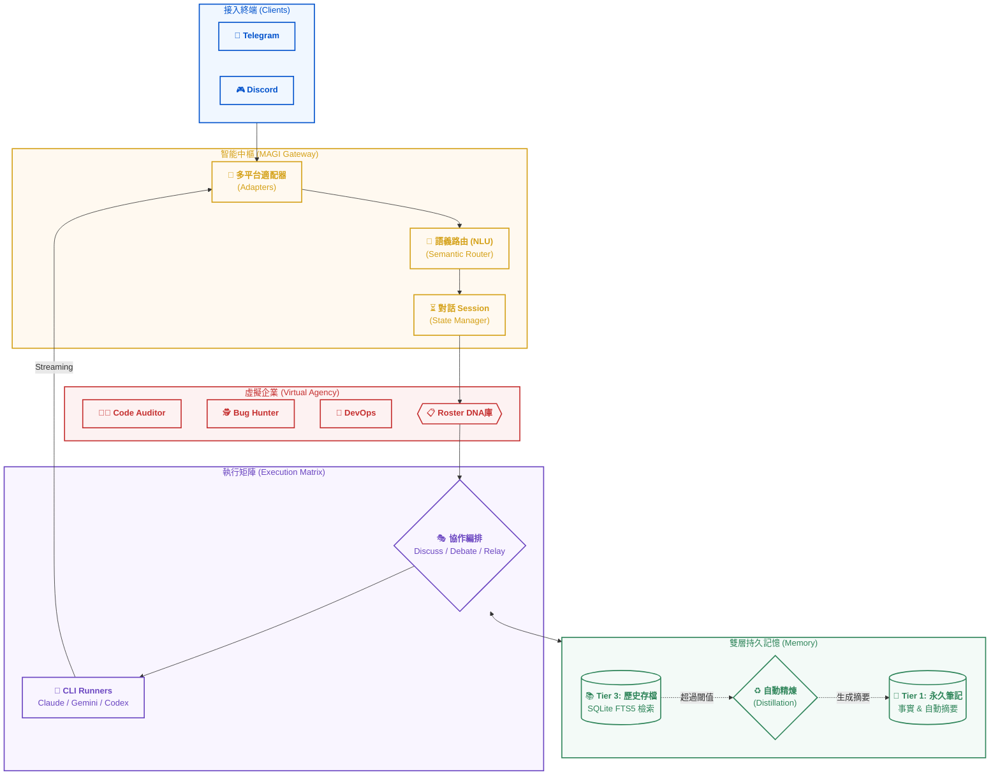

# mini_agent_team (Project MAGI)

**隨身攜帶的 AI 軟體公司** — 透過 Telegram 與 Discord 連接本機強大 CLI Agent（Claude Code、Gemini CLI 等）。具備「虛擬企業 (Agency)」架構、雙層持久記憶與自動精煉機制。

> English documentation: [README.md](README.md)

---

## 系統架構圖 (Project MAGI)



---

## 核心亮點

### 🏛️ 虛擬企業架構 (Virtual Agency)
不僅是聊天，而是建立一個具備「職位 DNA」的專家團隊。透過 `roster/*.md` 定義角色的使命與規則，系統會根據您的語義輸入（例如：「這段程式碼幫我過一遍」）自動切換到最適合的專家角色（如 `code-auditor`）。

### 🧠 記憶精煉 (Memory Distillation)
解決長對話導致的 Context 爆炸問題。當歷史對話過長時，系統會自動在背景啟動摘要程序，將過往細節壓縮成精煉事實並轉入 Tier 1 永久記憶，確保 AI 永遠記得重要的決策。

### 🎭 多 Agent 協作 (Orchestration)
內建「討論 (Discuss)」、「辯論 (Debate)」與「中繼 (Relay)」模式。您可以讓 Claude 與 Gemini 針對同一個架構問題進行辯論，產出更全面、低偏見的開發建議。

### ⚡ 極致串流體驗 (Streaming)
採用獨家 Streaming Bridge，無論是 CLI 工具產生的即時進度還是長篇代碼生成，都能在手機端即時跳動顯示，無需漫長等待。

---

## 快速開始

### 前置需求
- Python 3.12+
- 已安裝任一 CLI Agent：`claude` (Claude Code) 或 `gemini` (Gemini CLI)。
- Telegram/Discord Bot Token。

### 一鍵式安裝 (推薦)
```bash
curl -fsSL https://raw.githubusercontent.com/nchiyi/mini_agent_team/main/install.sh | bash
```

---

## 指令百科 (Command Encyclopedia)

| 分類 | 指令 | 說明 |
|------|------|------|
| **專家系統** | `/claude`, `/gemini` | 直接呼叫特定 AI Runner |
| | `/use <slug>` | 手動切換至 Roster 中的特定專家角色 |
| **協作模式** | `/discuss <r1,r2> [p]` | 多 Agent 腦力激盪 |
| | `/debate <r1,r2> [p]` | 多 Agent 對比辯論 |
| | `/relay <r1,r2> [p]` | 鏈式流水線處理 |
| **記憶操作** | `/remember <text>` | 存入永久事實 (Tier 1) |
| | `/recall <query>` | 全文搜尋歷史對話 (Tier 3) |
| **系統控制** | `/status`, `/usage` | 查看系統運行狀況與 Token 統計 |
| | `/new` 或 `/reset` | 重置當前 Session 與 Context |
| | `/cancel` | 立即停止目前的 AI 輸出 |
| | `/voice on/off` | 開啟或關閉語音轉文字功能 |

---

## 專案結構 (Directory Blueprint)

```text
mini_agent_team/
├── main.py                # 核心入口 (The Brain)
├── roster/                # 專家角色 DNA 定義庫
├── src/
│   ├── gateway/           # 語義路由與 NLU 核心
│   ├── core/memory/       # 雙層記憶與精煉邏輯
│   ├── agent_team/        # 多 Agent 協作模式實作
│   └── runners/           # CLI Subprocess 非同步監控
├── modules/               # 功能插件 (Web Search, Vision)
└── config/                # 系統配置與部署腳本
```

---

## 安全設計與政策

- **隱私至上**：記憶數據嚴格以 `(user_id, channel)` 進行物理隔離。
- **Fail-Closed**：`ALLOWED_USER_IDS` 為空時系統自動鎖定，防止未授權存取。
- **使用規範**：本平台僅限作為個人帳號之遠端控制工具。嚴禁將受版權保護的 CLI 工具（如 Claude Code）提供給多用戶代理使用。

---

## License

MIT License
