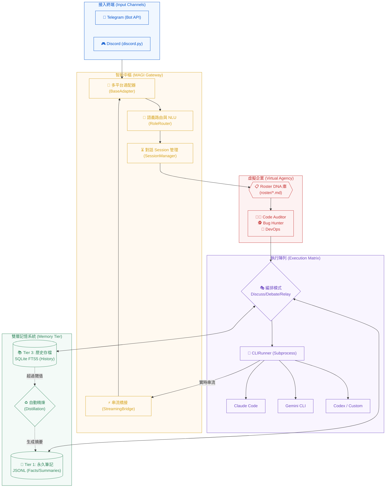

# mini_agent_team (Project MAGI)

**隨身攜帶的 AI 軟體公司** — 透過 Telegram 與 Discord 連接本地端強大 CLI Agent（Claude Code, Gemini CLI, Codex 等）。具備「虛擬企業 (Agency)」架構、雙層持久記憶與自動精煉機制。

> English documentation: [README.md](README.md)

---

## 系統架構圖 (Project MAGI)



---

## 核心亮點

- **多平台同步**：一個後端同時接通 Telegram 與 Discord。
- **虛擬企業架構 (Virtual Agency)**：透過 `roster/*.md` 定義專家職位 DNA，系統根據語義自動切換專家。
- **多 Agent 協作**：支援 Discuss（討論）、Debate（辯論）與 Relay（串聯）模式。
- **自動記憶精煉 (Distillation)**：自動摘要過長對話，解決 Context Window 爆炸問題。
- **即時串流回覆**：採用 Streaming Bridge 技術，回覆邊生成邊更新。
- **雙層儲存架構**：
  - **Tier 1**: 永久事實與自動摘要 (JSONL)。
  - **Tier 3**: 可全文檢索的對話歷史 (SQLite FTS5)。

---

## 快速開始 (Quick Start)

### 前置需求
- **Python 3.11+**
- **CLI Agents**: 至少安裝 `claude` (Claude Code), `gemini` (Gemini CLI) 或 `codex` 其中之一。
- **Tokens**: Telegram Bot Token 和/或 Discord Bot Token。

### 安裝方式

#### 1. 自動安裝 (一鍵腳本)
```bash
curl -fsSL https://raw.githubusercontent.com/nchiyi/mini_agent_team/main/install.sh | bash
```

#### 2. 手動安裝 (逐步執行)
```bash
# 複製專案
git clone https://github.com/nchiyi/mini_agent_team.git
cd mini_agent_team

# 建立虛擬環境
python3 -m venv venv
source venv/bin/activate

# 安裝套件
pip install -r requirements.txt

# 執行設定精靈
python3 -m src.setup.wizard
```

### 啟動應用
```bash
python3 main.py
```

---

## 設定說明 (Configuration)

### `secrets/.env`
```env
TELEGRAM_BOT_TOKEN=你的Token
DISCORD_BOT_TOKEN=你的Token (選填)
ALLOWED_USER_IDS=123456789,987654321  # 必填，空白則鎖定所有人
```

### `config/config.toml` 重要參數
```toml
[gateway]
default_runner = "claude"
session_idle_minutes = 60
stream_edit_interval_seconds = 1.5

[memory]
db_path = "data/db/history.db"
distill_trigger_turns = 20  # 超過 N 輪自動啟動精煉
```

---

## 指令百科 (Commands)

| 分類 | 指令 | 說明 |
|------|------|------|
| **切換** | `/claude`, `/gemini` | 切換當前 AI Runner |
| | `/use <role>` | 切換至特定專家角色 (Roster) |
| **協作** | `/discuss <r1,r2> [p]` | 多 Agent 腦力激盪 |
| | `/debate <r1,r2> [p]` | 多 Agent 對比辯論 |
| **記憶** | `/remember <text>` | 存入永久事實 (Tier 1) |
| | `/recall <query>` | 全文搜尋歷史對話 (Tier 3) |
| **系統** | `/status`, `/usage` | 查看系統狀態與 Token 統計 |
| | `/new`, `/cancel` | 重置 Session 或中斷輸出 |

---

## 專案結構 (Structure)

```text
mini_agent_team/
├── main.py                # 核心入口 (The Brain)
├── roster/                # 專家角色 DNA 定義庫 (.md)
├── src/
│   ├── channels/          # TG/DC 適配器實作
│   ├── gateway/           # 語義路由、Session 與串流管理
│   ├── core/
│   │   └── memory/        # 雙層記憶 (Tier 1/3) 與精煉邏輯
│   ├── runners/           # CLI Subprocess 執行封裝
│   └── agent_team/        # 多 Agent 協作模式邏輯
├── modules/               # 擴充外掛 (Web Search, Vision)
├── data/                  # 執行時數據 (Database, Logs)
└── config/                # 設定檔與自動化腳本
```

---

## 安全設計

- **隱私隔離**：記憶以 `(user_id, channel)` 嚴格隔離，防止數據洩漏。
- **權限黑名單**：`ALLOWED_USER_IDS` 為強制性設定，預設 fail-closed。
- **使用規範**：本工具僅限作為個人帳號之遠端控制工具。嚴禁將個人授權之 CLI Agent 提供給多人代理使用。

---

## License
MIT License
