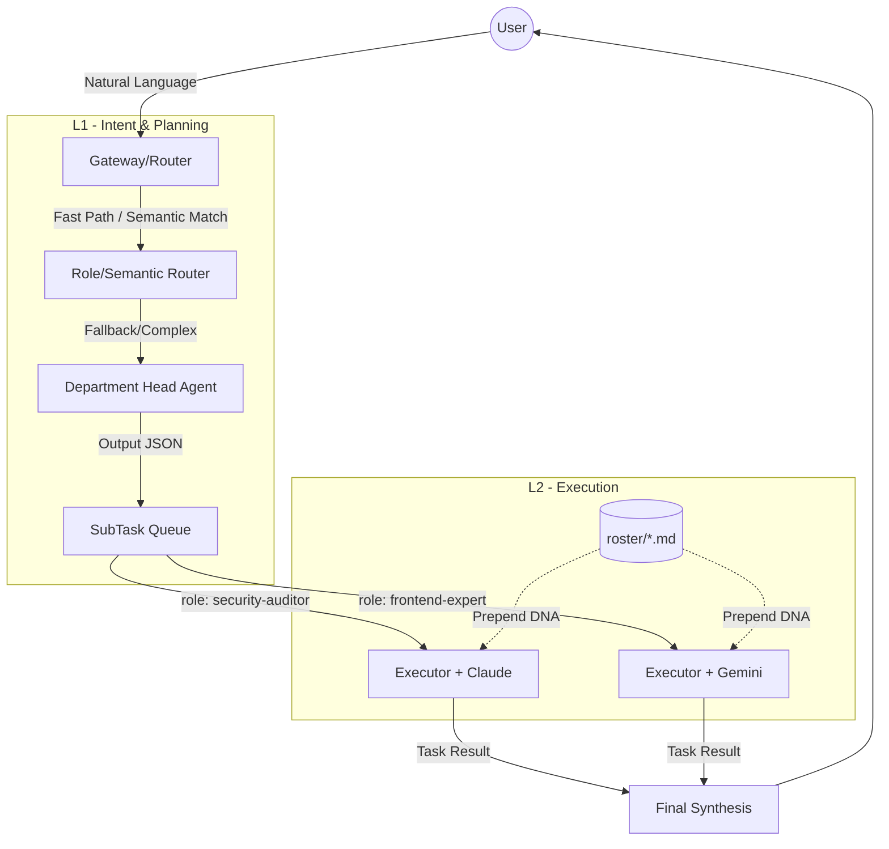

# mini_agent_team - Agency Integration 專案開發計畫暨需求規格書 (SRS)

**文件版本:** V1.0 (收斂版)
**日期:** 2026-04-23
**專案名稱:** mini_agent_team - 虛擬企業代理人系統升級 (Agency-Agents Integration)

---

## 1. 專案概述 (Introduction)

### 1.1 專案目的
本專案旨在將 `mini_agent_team` 從一個「單純調度多個底層模型 (Claude/Codex/Gemini) 的多頻道閘道器」，升級為一個**「層級化治理的虛擬企業 (Hierarchical Virtual Enterprise)」**。透過引入結構化的角色 DNA 與部門主管分派機制，讓 AI Agent 能具備高度專業化、嚴格遵守業務準則，並大幅提升解決複雜任務的能力與 Token 使用效率。

### 1.2 專案範圍
- **建立角色庫 (Roster)**：導入 Markdown 格式的角色 DNA 模板。
- **重構任務分派 (Orchestration)**：實作 `Department Head` (L1) 意圖解析與 `Sub-Agent` (L2) 執行委派的兩層扁平化架構。
- **語義路由優化 (Semantic Routing)**：引入本地輕量化 Embedding 技術，降低 LLM 路由的延遲與成本。
- **環境感知對齊**：統一工作目錄 (cwd) 錨點，並實作智能檔案解析，避免路徑迷失。

### 1.3 術語定義
- **L1 (Planner/Department Head)**：第一線接收用戶自然語言意圖的系統預設主管角色，負責拆解任務與分派。
- **L2 (Executor/Sub-agent)**：承接具體子任務的執行單位，執行時會繼承特定的角色 DNA。
- **DNA (eDNA)**：角色的核心準則 (Identity, Rules)，以 Markdown Frontmatter 定義。
- **Roster**：存放所有角色 DNA 的本機目錄 (`roster/*.md`)。

---

## 2. 系統架構設計 (System Architecture)

### 2.1 現行架構痛點
- 目前 `planner.py` 僅能將任務分派給不同的「模型 (Runner)」，缺乏「專業領域準則」的約束。
- 個性設定 (`/soul`) 缺乏結構化，無法針對不同子任務切換專長。
- Agent 在本地專案中常因相對路徑或上下文斷層導致找不到檔案。

### 2.2 目標架構 (To-Be Architecture)
系統將採用 **扁平化兩層架構 (Two-tier Flattened Hierarchy)**，嚴格禁止 L2 再次遞迴規劃以控制複雜度。

---

## 3. 功能需求規格 (Functional Requirements)

本專案依照相依性與交付物，拆分為三個獨立的規格模組 (Spec A, B, C)。

### 3.1 Spec A: 角色庫與基礎模組 (Roster & Agency Module)
**目標**：建立角色庫與手動切換狀態的管理機制。
- **REQ-A1 [角色庫]**: 系統需在根目錄具備 `roster/` 目錄，存放 `.md` 角色檔。
- **REQ-A2 [Schema]**: 角色檔必須遵循嚴格的 Markdown Frontmatter 格式，包含：
  - `slug` (字串, [a-z0-9-]): 系統唯一識別鍵。
  - `name` (字串): 顯示名稱。
  - `summary` (字串): 供意圖匹配的簡介。
  - `identity` (字串): 角色背景設定。
  - `rules` (字串): 強制遵守的準則。
  - `preferred_runner` (字串, 可選): 建議的執行引擎。
- **REQ-A3 [指令模組]**: 於 `src/modules/agency/` 實作模組，包含 `manifest.yaml` 與 `handler.py`，支援 `/agency list`, `/agency info <slug>`, `/agency use <slug>`。
- **REQ-A4 [狀態持久化]**: 選定的 `active_role` 需存放於 User Session 中，並在執行 `/new` 或 `/reset` 時自動清除。

### 3.2 Spec B: 角色感知調度與執行 (Role-Aware Orchestration)
**目標**：讓 Planner 能指派角色，Executor 能注入 DNA。
- **REQ-B1 [模型擴充]**: `SubTask` 資料結構必須擴充為 `{role: slug, runner: str, prompt: str, dod: str}`。
- **REQ-B2 [主管規劃]**: L1 `Department Head` (系統預設) 在分析意圖時，需能輸出包含目標 `role slug` 的任務計畫 JSON。
- **REQ-B3 [DNA 注入]**: Executor 在啟動 Sub-agent 前，必須依序將 `[Identity]` + `[Rules]` + `[Task Brief]` 拼接至 System Prompt 前端。
- **REQ-B4 [模型決議優先級]**: 當分配任務時，使用的 Runner 優先級為：User 顯式指定 > Role 建議 (`preferred_runner`) > 系統預設。
- **REQ-B5 [上下文最小化]**: L1 與 L2 之間僅傳遞 `Task Brief` 與 `Result`，禁止傳遞完整對話歷史 (Chat Transcript) 以節省 Token。
- **REQ-B6 [環境錨定]**: 所有 Sub-agent 執行時，其 `cwd` 必須強制鎖定為專案根目錄。

### 3.3 Spec C: 語義路由加速 (Semantic Router Spike)
**目標**：建立低延遲、無 LLM Token 成本的意圖分派預處理器。
- **REQ-C1 [輕量化檢索]**: 使用本地輕量化技術（初版使用現有 `sentence-transformers` 進行 Spike 驗證），將用戶輸入與 Roster 的 `summary/tags` 進行向量比對。
- **REQ-C2 [Fallback 機制]**: 若 Semantic Match (Top-1) 信心分數低於門檻，退回現有的 Heuristic Fast Path，最後才交由 L1 LLM 處理。
- **REQ-C3 [生命週期]**: Embedding Index 僅在服務啟動或 `roster/` 內容變更時重建，處理對話時僅作查詢。
- **REQ-C4 [智能檔案導航]**: L1 在背景自動掃描檔案結構時，限制掃描深度為 2 (`maxdepth 2`) 或限制 Top-N 匹配，嚴禁將全量目錄樹塞入 Prompt。

---

## 4. 非功能需求 (Non-Functional Requirements)

- **NFR-1 [效能與延遲]**: Spec C 的語義路由判斷時間需小於 500ms，以確保互動順暢。
- **NFR-2 [Token 經濟]**: 透過扁平化架構與 Context 最小化 (REQ-B5)，確保複雜任務的 Token 消耗不超過原先大一統對話的 1.5 倍。
- **NFR-3 [模組化解耦]**: 新功能嚴格遵守現有 `main.py` + `src/modules/loader.py` 的載入機制，不得修改或依賴舊有的 `skills/*.py` 架構。

---

## 5. 開發階段與里程碑 (Roadmap & Milestones)

| 階段 (Phase) | 對應 Spec | 關鍵交付物 (Deliverables) | 驗證標準 (Acceptance Criteria) |
| :--- | :--- | :--- | :--- |
| **Phase 1: 基礎建設** | Spec A (#18) | `roster/*.md` 模板 `modules/agency/` 模組實作 | 可使用 `/agency list` 列出角色，並透過 `/agency use` 切換 Session 狀態，無錯誤。 |
| **Phase 2: 核心調度** | Spec B (#17) | Planner Prompt 更新 Executor DNA 注入機制 | L1 可產出帶有 `role` 的 SubTask，且 L2 執行時行為明顯受到 DNA 規則約束（可透過 Debug Log 檢查 Prompt）。 |
| **Phase 3: 效能加速** | Spec C (#19) | 語義路由器 (Spike) 智能檔案導航限制 | 完成 Benchmark 報告，證明 Top-1 Match 準確率達標，且檔案路徑能被精確解析傳入 L2。 |

---
**[文件結束]**