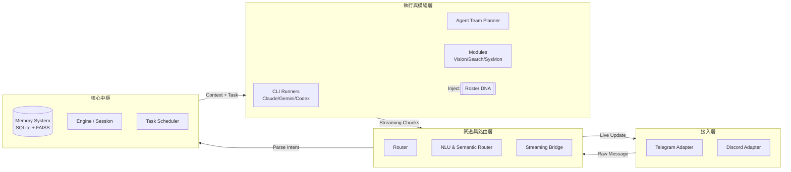

# mini_agent_team - 完整軟體需求規格書 (SRS) 暨 專案計畫書

**文件編號:** SRS-MAT-COMPLETE-V1.0
**日期:** 2026-04-23
**專案名稱:** mini_agent_team (多頻道全端 AI 代理人閘道器與虛擬企業系統)

---

## 1. 專案概述 (Project Overview)

### 1.1 系統願景
`mini_agent_team` 是一個強大的中介軟體 (Middleware) 與 AI 代理人作業系統。它的核心願景是將本地端強大的命令列 AI 工具（如 Claude Code, Codex, Gemini CLI）與使用者日常使用的通訊軟體（Telegram, Discord）無縫橋接。
隨著系統演進，專案已從單純的「訊息轉發器」升級為具備「長期記憶」、「多模組掛載」以及「層級化虛擬企業 (Agency)」的完整 AI 協作平台。

### 1.2 核心價值主張
- **行動端即時操控**: 讓開發者透過手機就能指揮電腦上的強大 AI 處理專案程式碼。
- **統一的記憶大腦**: 打破各家 CLI 工具獨立運作的孤島，統一管理使用者的上下文、長期事實與專案路徑。
- **專家團隊協作**: 透過 Agent Team 與 Agency 架構，讓 AI 自主分工，扮演不同領域專家完成複雜的軟體工程任務。

---

## 2. 系統總體架構 (System Architecture)

系統採用高度解耦的模組化架構，資料流由外而內分為四個主要層級：



---

## 3. 核心子系統規範 (Core Subsystems Specifications)

### 3.1 接入層 (Channels & Adapters)
- **功能**: 負責與外部通訊平台 API 溝通。
- **規範**:
  - **TelegramAdapter**: 支援長訊息自動分段 (Chunking) 與即時編輯 (Live Message Editing) 以呈現 Streaming 效果。
  - **DiscordAdapter**: 處理 Thread 建立與訊息接力。
  - **安全控管**: 嚴格的 `ALLOWED_USER_IDS` 白名單驗證，並支援「首次互動自動綁定 (Auto-bind)」。

### 3.2 閘道與路由層 (Gateway & Routing)
- **Router**: 解析以 `/` 開頭的顯式指令（如 `/status`, `/reset`, `/agency`）。
- **NLU (自然語言理解)**:
  - **Heuristic Fast Path**: 透過正規表示式辨識 `/relay`, `/discuss`, `/debate` 等多代理人協作模式。
  - **Semantic Router (新)**: 使用本地端 `fastembed` / `sentence-transformers` 將使用者的自然語言映射至最適合的專案角色 (Role Slug)。

### 3.3 記憶體系統 (Memory System)
整合於 `core/memory.py`，分為短期與長期記憶：
- **Tier 1 (短期工作記憶)**: 儲存近 100 筆對話上下文 (Session Context)。
- **Tier 3 (長期語義與事實)**:
  - **SQLite FTS5**: 用於儲存設定 (`active_role`, `user_facts`)、專案路徑映射與 Token 消耗日誌。
  - **FAISS Vector DB**: 儲存提煉後的長期事實，支援語義檢索。

### 3.4 執行引擎 (CLI Runners)
- **功能**: 以子行程 (Subprocess) 喚起底層二進制 AI 工具。
- **規範**:
  - 必須將輸出透過 `stdout.readline()` 封裝為非同步生成器 (AsyncGenerator) 實現 Streaming。
  - 每次執行皆需寫入本地 Audit Log (稽核日誌) 以供追蹤。

---

## 4. 模組與虛擬企業 (Modules & Agency Integration)

### 4.1 內建模組 (Built-in Modules)
系統支援動態掛載的 `modules/`，目前包含：
- **Vision**: 處理影像辨識 (透過 Ollama/Llava 或 API)。
- **Web Search**: 網路資料爬取與摘要。
- **System Monitor**: 主機資源與狀態監控。
- **Dev Agent**: 專案碼庫輔助模組。

### 4.2 虛擬企業與角色庫 (Agency Roster - 新增)
為解決單一 Agent 能力受限的問題，導入「虛擬企業」層級化架構：
- **Roster 目錄**: 存放 Markdown 格式的角色 DNA (Identity, Rules, Preferred Runner)。
- **Department Head (L1)**: 作為預設接入角色，負責理解需求並規劃任務。
- **執行者注入 (L2)**: Sub-agent 執行前，系統會將對應的角色 DNA 拼接入 System Prompt。

### 4.3 任務編排器 (Agent Team Planner & Executor)
- **Planner (`planner.py`)**: L1 角色產出包含 `[role, runner, prompt, dod]` 的 JSON 執行計畫。
- **Executor (`executor.py`)**: L2 角色依據計畫並行建立獨立的工作樹 (Worktree)，注入 DNA 並執行 CLI Runner。
- **Context 最小化**: 層級間僅傳遞 Task Brief 與 Result，禁止全量 Transcript 傳遞。

---

## 5. 資料模型設計 (Data Models)

### 5.1 SQLite 資料庫綱要
- `messages`: `id, user_id, role, content, timestamp`
- `settings`: `user_id, key, value` (存放 `active_role`, `personality` 等)
- `projects`: `name, path, description`
- `usage_logs`: `user_id, model, prompt_tokens, completion_tokens, estimated_cost`

### 5.2 SubTask 資料結構 (Orchestration)
```python
@dataclass
class SubTask:
    id: str
    agent: str         # 執行的 Runner (claude, codex, gemini)
    prompt: str        # 任務目標
    role: str          # 角色 Slug (對應 roster/*.md)
    dod: str           # 完工定義 (Definition of Done)
    worktree_path: str # 隔離執行目錄
    status: str        # pending, running, done, failed
    result: str        # 執行摘要
```

---

## 6. 非功能需求 (Non-Functional Requirements)

### 6.1 效能與延遲
- **Streaming 響應**: 終端訊息流必須在 AI 產出首個 Token 後的 1 秒內推播至 Telegram/Discord。
- **語義路由**: 本地端 Embedding 匹配耗時不得超過 500ms。

### 6.2 安全性與權限
- **隔離執行**: 多代理人協作時，必須建立隔離的 Git Worktree 避免寫入衝突。
- **權限認證**: 僅允許 `ALLOWED_USER_IDS` 名單內的使用者觸發 CLI 指令。

### 6.3 成本與 Token 控管
- **背景檔案發現**: 系統進行檔案路徑定位時，採用 `find` 或 `git ls-files`，嚴禁將超過 100 行的目錄樹直接塞入 LLM Prompt。
- **扁平化限制**: Agency 任務委派嚴格限制為兩層 (L1 -> L2)，禁止子任務再衍生子任務。

---

## 7. 專案開發階段與里程碑 (Roadmap)

### Phase 1: 核心通道與基礎建設 (已完成)
- [x] Telegram / Discord Adapter 實作與 Streaming Bridge。
- [x] CLI Runner (Claude, Codex, Gemini) 橋接。
- [x] 基礎 SQLite 記憶體與 Session 狀態管理。

### Phase 2: 模組化與多代理人協作 (已完成)
- [x] 動態 Module Loader (`manifest.yaml` 支援)。
- [x] Agent Team Planner (單純模型指派) 與 Parallel Executor。
- [x] NLU 啟發式路由 (Relay, Discuss, Debate 模式)。

### Phase 3: Agency 虛擬企業架構升級 (開發中)
- [ ] **Spec A**: `roster/` 目錄建立與 `modules/agency/` 手動角色切換實作。
- [ ] **Spec B**: `SubTask` 模型擴充，實作 L1(Planner) 指派角色與 L2(Executor) DNA 注入。
- [ ] **Spec C**: 引入 `fastembed` 進行本地語義路由，實作智能檔案解析。

---
**[文件結束]**
