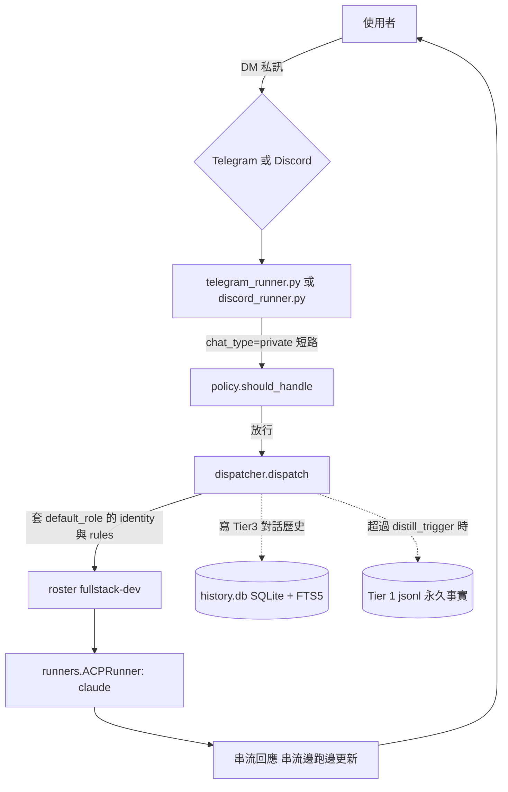
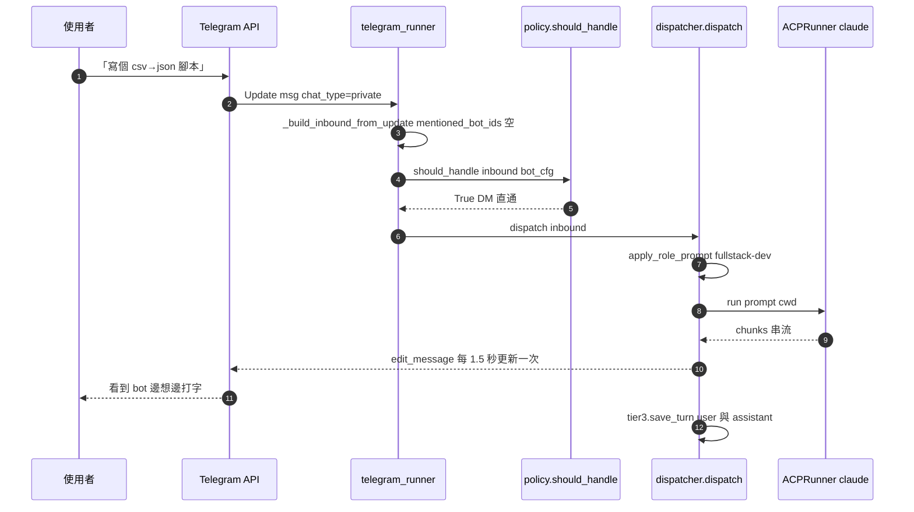

# 情境 1：DM 1:1 對話

> 最簡單的場景：一個使用者直接私訊（Telegram DM 或 Discord DM）一隻 bot，bot 用配置的 `default_runner` + `default_role` 回應。沒有群組、沒有多 bot、沒有 mention 解析——直接命中 `policy.should_handle()` 的 DM short-circuit 路徑。

## 適用場景

- 個人助理：你需要一隻 24 小時在線的 bot 處理日常編程 / 寫作 / 研究
- 專屬專家：把一隻 bot 永久綁在某個 roster 角色（例如 `fullstack-dev`）
- Mac / iPhone 隨手 prompt：用 Telegram client 走到哪傳到哪
- 第一次裝 MAT 的 baseline 場景：跑通這個再考慮多 bot

## 系統需求

| 項目 | 內容 |
|------|------|
| Channel | Telegram **或** Discord（兩個都裝也可，這篇分開介紹） |
| Bot 數 | 1 |
| 必填欄位 | `token_env`、`default_runner`、`channel`（在 `[bots.<id>]` 段落下） |
| 選填欄位 | `default_role`、`label` |
| 群組欄位 | **完全不設** — 不寫 `allow_all_groups` / `allowed_chat_ids` 即等於只接受 DM |
| Roster | 任意 `roster/<slug>.md`（建議 `fullstack-dev`） |

整個情境只用到 `policy.py:36-43` 那段 DM 路徑：

```python
if inbound.chat_type == "private":
    if turns is not None and not turns.claim_message(...):
        return False
    return True
```

→ 不檢查群組白名單、不檢查 `@mention`、不檢查 `allow_bot_messages`。最快的路徑。

---

## 設定步驟

### Telegram

1. 開啟 Telegram，搜尋 `@BotFather`，傳 `/newbot`，依提示給 bot 取名與 username（必須以 `_bot` 或 `bot` 結尾）。
2. BotFather 回傳一串 `123456789:AABBCC...` 的 token——這就是你的 `BOT_<ID>_TOKEN`。
3. 把 token 存進 `secrets/.env`：

   ```env
   ALLOWED_USER_IDS=123456789       # 你自己的 telegram user id
   BOT_DEV_TOKEN=123456789:AABBCC...
   ```

4. 推薦：用互動式工具加 bot：

   ```bash
   python3 -m src.setup.add_bot --channel telegram
   ```

   照提示輸入 bot id（例如 `dev`）、`token_env` 名稱、`default_runner`（claude / codex / gemini 三選一）、`default_role`（從 `roster/` 內挑一個 slug）即可。

5. 或手編 `config/config.toml`，加入：

   ```toml
   [bots.dev]
   channel        = "telegram"
   token_env      = "BOT_DEV_TOKEN"
   default_runner = "claude"
   default_role   = "fullstack-dev"
   label          = "Dev Assistant"
   ```

6. 重啟：

   ```bash
   mat restart
   mat logs 50          # 確認 "Registered bot @xxxxx as dev"
   ```

7. 在 Telegram 找到你的 bot 名（例如 `@my_dev_bot`），點 Start，傳一句話測試。

### Discord

1. 進 <https://discord.com/developers/applications>，按 **New Application** → 命名。
2. 左側 **Bot** → **Add Bot** → **Reset Token**，複製 token。
3. **Privileged Gateway Intents** 把 `Message Content Intent` 開啟（不開的話 bot 收到的 `message.content` 會是空字串）。
4. 左側 **OAuth2 → URL Generator** → 勾 `bot` scope，下方 permissions 至少勾 `Send Messages` + `Read Message History`，複製產生的邀請連結，到瀏覽器內把 bot 拉進你想要 DM 的 server。
5. 在 `secrets/.env` 寫：

   ```env
   BOT_DEV_DC_TOKEN=Mz...的 Discord token
   ```

6. `config/config.toml` 加：

   ```toml
   [bots.dev_dc]
   channel        = "discord"
   token_env      = "BOT_DEV_DC_TOKEN"
   default_runner = "claude"
   default_role   = "fullstack-dev"
   label          = "Dev Assistant (Discord)"
   ```

7. `mat restart`，等 `Registered bot ... as dev_dc` log 出現後，到 Discord 用戶清單對 bot 名右鍵 **Send Message**，即可開 DM。

> Discord 端也可以**不寫**任何 `[bots.*]` 區塊、改用舊的 `DISCORD_BOT_TOKEN` 環境變數，會走 `src/core/bots.py:load_bots` 內的 legacy fallback 自動合成 `BotConfig(id="default", channel="discord")`。但既然要走多 bot 路徑，建議直接顯式宣告 `[bots.dev_dc]`，未來要加第二隻 bot 不必改架構。

---

## 操作方式

啟動完成後直接傳訊息即可。bot 會用 `default_role` 套上 roster identity + rules，再送進 `default_runner` 對應的 CLI agent。

```
你 → @my_dev_bot：「寫個 Python 腳本，把當前資料夾下所有 .csv 合成一份 .json」

@my_dev_bot（claude + fullstack-dev）：
  ```python
  import csv, json, glob
  ...
  ```
  說明：以上腳本會...

你 → @my_dev_bot：「改成處理 nested objects」

@my_dev_bot：
  好的，更新版：（保留上一輪 context）
  ...

你 → @my_dev_bot：「/remember 我偏好用 dataclasses 不用 dict」

@my_dev_bot：「Remembered: 我偏好用 dataclasses 不用 dict」

→ 之後 bot 寫 Python 都會優先用 dataclasses
```

常用命令（更多請看 [`docs/user-manual.md`](../user-manual.md) §5）：

| 命令 | 用途 |
|------|------|
| `/use <slug>` | 換 roster 角色（例如 `/use code-auditor`） |
| `/claude` / `/codex` / `/gemini` | 切 runner |
| `/remember <text>` | 寫 Tier 1 永久事實 |
| `/recall <query>` | 全文搜尋過去對話 |
| `/discuss claude,codex,gemini <prompt>` | 三個 runner 同 session 討論 |
| `/voice on` | 啟用 TTS 語音回覆 |
| `/new` | 重置當前對話 context（記憶仍保留） |
| `/status` | 查目前 runner / role / cwd |

---

## 架構圖



---

## 訊息流程



---

## 常見問題

**Q: bot 已啟動但傳訊息沒反應、`mat logs` 也沒看到 inbound？**
A: 八成是 `ALLOWED_USER_IDS` 沒設或不包含你的 user id。MAT 預設 fail-closed，未授權 user 連 log 都不會出（adapter 層直接擋，可看 `mat logs error`）。在 Telegram 對 bot 傳 `/start`，`mat logs` 會印出你的 user id，把它加到 `secrets/.env` 即可。

**Q: bot 回 `An error occurred. Please try again.` 或卡在 typing？**
A: 95% 是 docker 模式下沒跑 `mat auth`。執行 `mat auth all` 把 claude / codex / gemini 三個都登入一次。詳見 [`README.md`](../../README.md) 「Bot 回 An error occurred」段落。

**Q: 我不想設 `default_role`，能不能讓 bot 自然路由？**
A: 可以。`default_role` 留空（或不寫）會吃 `_DEFAULT_ROLE = "department-head"`（`src/gateway/dispatcher.py:38`）。如果你連 department-head 也不要，roster 路由仍會走 FastEmbed semantic match 試圖匹配對應 role；找不到時就走純 runner（無 role prefix）。

**Q: bot 在群組裡會回應嗎？**
A: **不會**。本情境完全沒寫 `allow_all_groups` / `allowed_chat_ids`，這兩欄預設值是 `False` / `None`，policy 在群組路徑會直接 `return False`。即使有人把 bot 拉進群組也不會說話。要群組行為請看 [情境 2](02-group-multibot.md)。

**Q: 同一個 bot 同時有 DM 與群組的對話，會混嗎？**
A: 不會。記憶分桶 key 是 `(user_id, channel, bot_id, chat_id)`，DM 的 `chat_id == user_id` 與群組的 `chat_id` 是負數（Telegram）/ 正整數（Discord），不會衝突。

---

## 進階

### 切換 roster 角色

對 bot 傳 `/use code-auditor` 即可永久切換到「代碼審計員」角色（直到下次 `/use` 或 `/new`）。`default_role` 是「session 啟動時的預設」，使用者中途可以隨時改。

### 換 runner

`/codex` / `/gemini` / `/claude` 可以即席換到別的 CLI agent。或一次性：`/codex 寫個快取裝飾器` 只把這一句話丟給 codex 跑，下一句又回到 default_runner。

### 同一 user 開多隻專屬 bot

可以再宣告 `[bots.review]` 配 `default_runner = "codex"` + `default_role = "code-auditor"`，這樣你會有 `@my_dev_bot`（claude）跟 `@my_review_bot`（codex）兩隻同時上線、各自記憶獨立。看 [情境 2](02-group-multibot.md) 的「多 bot 各司其職」段落。

### 多 channel 共用一隻人格

要的話 Telegram 跟 Discord 各起一個 `[bots.X]` 區塊（不同 `id`、不同 `token_env`、相同 `default_role`）即可。注意：兩邊 channel 的記憶仍分桶（key 含 `channel`），所以 user 在 Telegram 的對話不會洩漏到 Discord，反之亦然。

### 換到 docker 模式或 systemd

DM 1:1 場景對部署模式無感——`foreground` / `launchd` / `systemd` / `docker` 都行。docker 模式下記得每個 CLI 跑一次 `mat auth <cli>`（首次認證後 token 會寫進 named volume `mat-agent-home`，後續 rebuild 不會丟）。

---

## 相關檔案速查

- `src/gateway/policy.py:36-43` — DM short-circuit 邏輯
- `src/core/bots.py:BotConfig` — 設定欄位定義
- `src/setup/add_bot.py` — 互動式新增 bot 工具
- `roster/fullstack-dev.md` — 範例角色檔
- `config/config.toml.example` — 完整設定檔範例（含註解）

---

下一站：[情境 2（群組 1:多 bot）](02-group-multibot.md) — 把多隻 bot 拉進同一個群組，依 `@mention` 各自路由。
