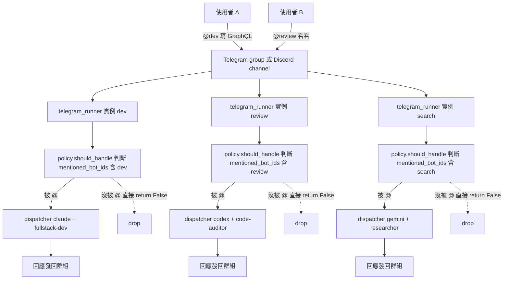
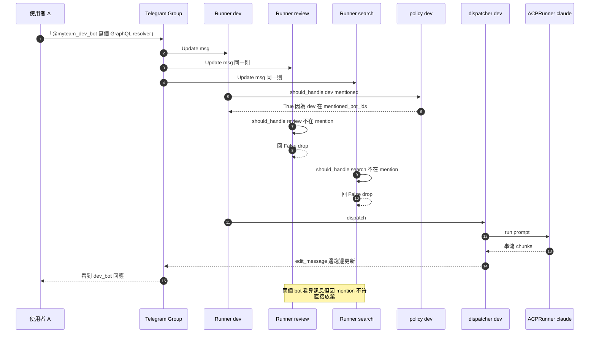

# 情境 2：群組 1:多 bot（並列獨立）

> 把多隻 bot 拉進同一個 Telegram group / Discord channel，每隻 bot 各自綁不同 runner + role。使用者用 `@mention` 點名哪隻就哪隻回應；沒被 mention 的 bot 安靜不出聲。bot 之間互不對話（`allow_bot_messages = "off"`）。

## 適用場景

- 多人小團隊：你跟夥伴在同一個 Telegram group 共用「dev / reviewer / researcher」三隻 bot
- 工具箱思維：把 group 當控制台，需要哪個專業就 `@` 它
- 不想要 bot 之間互動造成 token 浪費（`allow_bot_messages = "off"` 阻斷 bot 鏈式呼叫）
- 想保留「人類控制節奏」——所有對話都由 user 觸發，bot 不主動串話

跟情境 3（Bot 接力）的差別：本情境**禁止 bot 之間對話**；情境 3 啟用 bot↔bot mention 形成接力工作流。

## 系統需求

| 項目 | 內容 |
|------|------|
| Channel | 一個 Telegram group / Discord channel（兩邊都示範） |
| Bot 數 | 2-N 隻（這篇用 3 隻：dev、review、search） |
| 必填欄位 | `allowed_chat_ids = [...]` 或 `allow_all_groups = true`（其一） |
| 關鍵欄位 | `allow_bot_messages = "off"`（**預設值就是這個**，禁止 bot↔bot） |
| 關閉欄位 | `respond_to_at_all = false` 或不寫（避免 `@all` 觸發所有 bot 同時跑） |
| Roster | `fullstack-dev` / `code-auditor` / `expert-architect`（皆已存在於 `roster/`）+ 自訂 `researcher` |

> **`researcher` 角色預設不在 repo 內**——本情境會用到它，請先參考下面「進階 → 新增 researcher 角色」段落建立 `roster/researcher.md`，或把示例中的 `default_role = "researcher"` 改成既有角色（如 `expert-architect`）。

關鍵 policy 路徑（`src/gateway/policy.py`）：

```python
# ── Group authorisation ──
if not bot_cfg.allow_all_groups:
    allowed = bot_cfg.allowed_chat_ids or []
    if inbound.chat_id not in allowed:
        return False

# ── Bot-to-bot policy ──
if inbound.from_bot:
    policy = bot_cfg.allow_bot_messages
    if policy == "off":
        return False        # ← 本情境會走這條
    ...

# ── Human in group ──
if bot_cfg.id not in inbound.mentioned_bot_ids:
    return False           # ← 沒被 @ 的 bot 噤聲
```

→ 三隻 bot 同時收到群組訊息，但只有被 `@` 那一隻 `should_handle()` 回 True，其他兩隻直接 short-circuit。

---

## 設定步驟

### Telegram

#### 1. 申請三個 bot

對 `@BotFather` 各跑一次：

```
/newbot → 名字「Dev Assistant」、username「myteam_dev_bot」
/newbot → 名字「Code Reviewer」、username「myteam_review_bot」
/newbot → 名字「Researcher」、username「myteam_search_bot」
```

每個都會拿到一個 token。

#### 2. **關閉 Privacy Mode（重要）**

每隻 bot 都要做：

```
/setprivacy → 選 myteam_dev_bot → Disable
/setprivacy → 選 myteam_review_bot → Disable
/setprivacy → 選 myteam_search_bot → Disable
```

不關 Privacy 的話，bot 在群組只看得到「以 `/` 開頭的訊息」+「@username 直接點名的訊息」+「reply 自己的訊息」。其他訊息一律 invisible。本情境只用 `@username` 路由的話可以**不關**，但建議關掉以免將來情境變複雜。

#### 3. 把三隻 bot 拉進同一個群組

群組 → Members → Add → 搜 `@myteam_dev_bot` 等三個 username 加進來。**先別傳訊息**——下一步要拿 chat_id。

#### 4. 取得群組 chat_id

任一 bot 都行：在群組內傳 `/start` 或隨便一句話（先別管 bot 不回應，這是預期的，因為還沒設 allowed_chat_ids）。然後在你的 mat 機器上：

```bash
mat logs 100 | grep chat_id
```

你會看到類似 `chat_id=-1001234567890`（Telegram 群組 chat_id 一律是負數）。記下這個數字。

#### 5. 寫 `secrets/.env`

```env
ALLOWED_USER_IDS=123456789,987654321        # 你跟夥伴的 user id（用逗號分隔）
BOT_DEV_TOKEN=111:AAA...
BOT_REVIEW_TOKEN=222:BBB...
BOT_SEARCH_TOKEN=333:CCC...
```

#### 6. 寫 `config/config.toml`

```toml
[bots.dev]
channel              = "telegram"
token_env            = "BOT_DEV_TOKEN"
default_runner       = "claude"
default_role         = "fullstack-dev"
label                = "Dev Assistant"
# ── 群組設定 ──
allow_all_groups     = false                  # 走白名單（推薦）
allowed_chat_ids     = [-1001234567890]       # 步驟 4 拿到的 chat_id
allow_bot_messages   = "off"                  # 不跟其他 bot 互動
respond_to_at_all    = false                  # 不被 @all 召喚

[bots.review]
channel              = "telegram"
token_env            = "BOT_REVIEW_TOKEN"
default_runner       = "codex"
default_role         = "code-auditor"
label                = "Code Reviewer"
allow_all_groups     = false
allowed_chat_ids     = [-1001234567890]
allow_bot_messages   = "off"
respond_to_at_all    = false

[bots.search]
channel              = "telegram"
token_env            = "BOT_SEARCH_TOKEN"
default_runner       = "gemini"
default_role         = "researcher"           # 需先建立 roster/researcher.md
label                = "Researcher"
allow_all_groups     = false
allowed_chat_ids     = [-1001234567890]
allow_bot_messages   = "off"
respond_to_at_all    = false
```

#### 7. 重啟並驗證

```bash
mat restart
mat logs 100 | grep "Registered bot"
# 應看到三行：
# Registered bot @myteam_dev_bot as dev
# Registered bot @myteam_review_bot as review
# Registered bot @myteam_search_bot as search
```

回到群組傳 `@myteam_dev_bot 你好`，dev_bot 應該回應；其他兩隻噤聲。

### Discord

差異主要在「Developer Portal 申請」與「`allowed_chat_ids` 是 channel id（正整數）」：

#### 1. 三個 application

到 <https://discord.com/developers/applications> 重複三次：New Application → Bot → Reset Token → 開 `Message Content Intent` → OAuth2 URL Generator 拉進你的 server。

#### 2. 取得 channel id

桌面 Discord → User Settings → Advanced → 開 **Developer Mode**。對你想用的 channel 名右鍵 → **Copy Channel ID**。

#### 3. 寫 `secrets/.env`

```env
BOT_DEV_DC_TOKEN=...
BOT_REVIEW_DC_TOKEN=...
BOT_SEARCH_DC_TOKEN=...
```

#### 4. 寫 `config/config.toml`

```toml
[bots.dev_dc]
channel              = "discord"
token_env            = "BOT_DEV_DC_TOKEN"
default_runner       = "claude"
default_role         = "fullstack-dev"
allow_all_groups     = false
allowed_chat_ids     = [1234567890123456789]   # Discord channel id（正整數）
allow_bot_messages   = "off"
respond_to_at_all    = false

[bots.review_dc]
channel              = "discord"
token_env            = "BOT_REVIEW_DC_TOKEN"
default_runner       = "codex"
default_role         = "code-auditor"
allow_all_groups     = false
allowed_chat_ids     = [1234567890123456789]
allow_bot_messages   = "off"
respond_to_at_all    = false

[bots.search_dc]
channel              = "discord"
token_env            = "BOT_SEARCH_DC_TOKEN"
default_runner       = "gemini"
default_role         = "researcher"
allow_all_groups     = false
allowed_chat_ids     = [1234567890123456789]
allow_bot_messages   = "off"
respond_to_at_all    = false
```

更多 Discord 細節請看 [`docs/discord-multi-bot.md`](../discord-multi-bot.md)。

---

## 操作方式

群組對話範例（你 + 夥伴 + 三隻 bot 都在）：

```
你：「@myteam_dev_bot 寫個 GraphQL resolver 抓 user 跟 posts」

@myteam_dev_bot（claude + fullstack-dev）：
  ```graphql
  type User { id: ID!  posts: [Post!]! }
  ```
  ```python
  async def resolve_user_posts(parent, info):
      return await Post.filter(user_id=parent.id).all()
  ```
  注意：以上有 N+1 query 風險...

夥伴：「@myteam_review_bot 看看上面這段有什麼問題」
（review_bot 看得到群組歷史，能直接讀剛剛 dev_bot 的回應）

@myteam_review_bot（codex + code-auditor）：
  風險等級 [HIGH]：
  - N+1 query：每個 user 拉 posts 都另開 query。
  - 建議用 DataLoader 做 batching...

你：「@myteam_search_bot DataLoader 是什麼？對 GraphQL 必要嗎？」

@myteam_search_bot（gemini + researcher）：
  DataLoader 是 Facebook 開源的批次 + 快取工具...
  ...

→ dev_bot 不跨群組看 review_bot 的對話歷史（記憶仍分桶到自己的 bot_id），
  但 dev_bot 看得到「群組 chat_id 內所有自己曾經處理過的訊息」（因為記憶
  key 是 (user_id, channel, bot_id, chat_id)，本情境內 chat_id 共用群組 id）。
```

要點：

- **沒 `@` 的 bot 完全不出聲**——這是 `policy.py:71-72` 的最後一段守門。
- bot 看見群組訊息但**不互回**——`allow_bot_messages = "off"` 直接 `return False`。
- 每隻 bot 在群組的記憶都是 `(your_user_id, "telegram", bot_id, group_chat_id)` 鎖定的，**換個群組記憶會重新開始**（因為 chat_id 變了）。

---

## 架構圖



每隻 bot 跑各自的 polling loop（Telegram）/ Gateway client（Discord），同一則群組訊息**三隻 bot 都會收到**，但 `should_handle` 把沒被 `@` 的擋下。

---

## 訊息流程



---

## 常見問題

**Q: bot 在群組裡完全不回應？**
A: 按優先順序檢查：
1. `mat logs 100 | grep "chat_id="`，確認群組 chat_id 真的在 `allowed_chat_ids` 內。Telegram 群組 id 是負數（含開頭的 `-100`），別漏掉。
2. `mat logs 100 | grep "Registered bot"` 確認 bot 啟動成功。
3. Privacy Mode 沒關的話，bot 只看得到 `@username + 後面有空格`格式的 mention。試試直接點 bot 的 `@` 名（Telegram 會自動補全）。
4. 你的 user id 在 `ALLOWED_USER_IDS` 內嗎？

**Q: 我 `@` 了 bot 但它沒有回應，但同一隻在 DM 是好的？**
A: 八成是 `bot_registry` 解析失敗。`mentioned_bot_ids` 由 `bot_registry.resolve(channel, username)` 反查 bot id。如果 bot 啟動時 `getMe()` 沒拿到 username（網路抖動或 token 壞了），register 不會發生。看 `mat logs error`。

**Q: 兩個 user 同時 `@` 同一隻 bot，會被併發處理嗎？**
A: 是的，每個 inbound 走獨立 dispatch 路徑。但 `gateway.rate_limit.max_concurrent_dispatches`（預設 5）限制並發；超過會排隊。

**Q: bot 在群組內能看到別人說的話嗎？能根據前文回應嗎？**
A: 可以。每隻 bot 的 group history 是以 `(user_id, channel, bot_id, chat_id)` 分桶——「user_id 角度」記每個 user 跟此 bot 的對話。但**這隻 bot 自己不會看到其他 bot 跟使用者的對話**，因為 bot_id 不同。所以「上面 dev_bot 寫了什麼，review_bot 看得見嗎？」答案是：**review_bot 直接從群組訊息流看得見**（因為 telegram 把整個群組所有訊息都送給每隻 bot 的 polling loop），但**review_bot 的記憶資料庫不會記錄 dev_bot 的訊息**——當你過幾天再 `@review_bot`，它的 context 只看得到自己過去處理過的對話。如果你要強制把 dev_bot 的輸出餵給 review_bot，請把 dev_bot 的回應 quote-reply 給 review_bot，這樣 telegram 會把那段文字塞進 review_bot 的 inbound。

**Q: 想讓 bot 之間自動接力（dev_bot 寫完叫 review_bot 接手）？**
A: 那是[情境 3（Bot 接力工作）](03-bot-relay.md)，需要把 `allow_bot_messages` 改成 `"mentions"`。本情境刻意關掉。

**Q: 用 `@all` 一次喚醒所有 bot 可以嗎？**
A: 本情境每隻 bot 的 `respond_to_at_all = false`，所以不會。要那行為請看 [情境 4（共同研究）](04-collaborative-research.md)。

---

## 進階

### 新增 `researcher` 角色

`roster/researcher.md`（需自行建立）：

```markdown
---
slug: researcher
name: 研究員 (Researcher)
summary: 負責資料蒐集、文獻交叉比對、可信度評估的研究專家。
identity: 你是一位嚴謹的研究員，習慣引用一手來源、列出參考連結、明確標示推論強度。
rules:
  - 任何結論必須附上至少一個 verifiable 來源（連結或文獻名稱）。
  - 區分「事實 / 推論 / 觀點」三層，並明確標示。
  - 拒絕未經查證的傳聞性陳述。
preferred_runner: gemini
tags:
  - research
  - knowledge
---
研究員角色，搭配 gemini runner 適合做文獻探勘與資料佐證。
```

寫好後 `mat restart`，bot 會自動讀到 frontmatter，`/use researcher` 即可切換。

### 想用 `allow_all_groups = true` 嗎？

把 `allow_all_groups = true` 設下去後，**任何**把該 bot 拉進的群組都能跟它互動（前提是說話者在 `ALLOWED_USER_IDS`）。風險：認識你的人都能把你的 bot 拉到任何群組撞 token budget。`search` bot 因為通常工具屬性比較強，可考慮這樣設；`dev` / `review` 建議鎖白名單。

### 同 channel 內多群組怎辦？

`allowed_chat_ids` 是個 list，可以一次寫多個：

```toml
allowed_chat_ids = [-1001234567890, -1009876543210, -1005555555555]
```

每個群組對該 bot 的記憶獨立（chat_id 不同 → 分桶 key 不同）。

### 想關掉某個群組的某隻 bot？

把它從 `allowed_chat_ids` 拿掉、`mat restart` 即可。bot 仍在群組內（telegram member），但 policy 會擋訊息。要徹底踢掉的話到 telegram 把 bot member 移除。

### 多 bot 在同群組同時被 `@` 怎辦？

`@dev @review 看看這段` 兩個 bot 都會回——它們各自 dispatch、互不知道對方在跑。輸出順序不保證（看 LLM 速度）。如果想做「先 dev 寫、再 review 評」這種有順序的接力，看 [情境 3](03-bot-relay.md)。

### 多人團隊權限管理

`ALLOWED_USER_IDS` 是 process 全域；想要「夥伴 A 只能用 dev_bot 不能用 review_bot」這種細粒度，可在 `[bots.<id>]` 寫 per-bot：

```toml
[bots.review]
allowed_user_ids = [123456789]   # 只有你能用 review
```

優先序：per-bot > per-channel `[telegram] allowed_user_ids` > global `ALLOWED_USER_IDS`（`src/channels/telegram_runner.py:122-134`）。

---

## 相關檔案速查

- `src/gateway/policy.py:46-79` — 群組 + bot↔bot + human-in-group 三段路徑
- `src/gateway/dispatcher.py:_expand_at_all` — `@all` 展開（本情境關閉）
- `src/channels/telegram_runner.py:_build_inbound_from_update` — `mentioned_bot_ids` 解析
- `src/gateway/bot_registry.py` — username → bot_id 反查表
- `roster/fullstack-dev.md` / `roster/code-auditor.md` — 範例 role 檔
- `docs/discord-multi-bot.md` — Discord 多 bot 細節

---

下一站：[情境 3（Bot 接力工作）](03-bot-relay.md) — 把 `allow_bot_messages` 開到 `"mentions"`，讓 bot 互相 `@mention` 託付下一階段。
