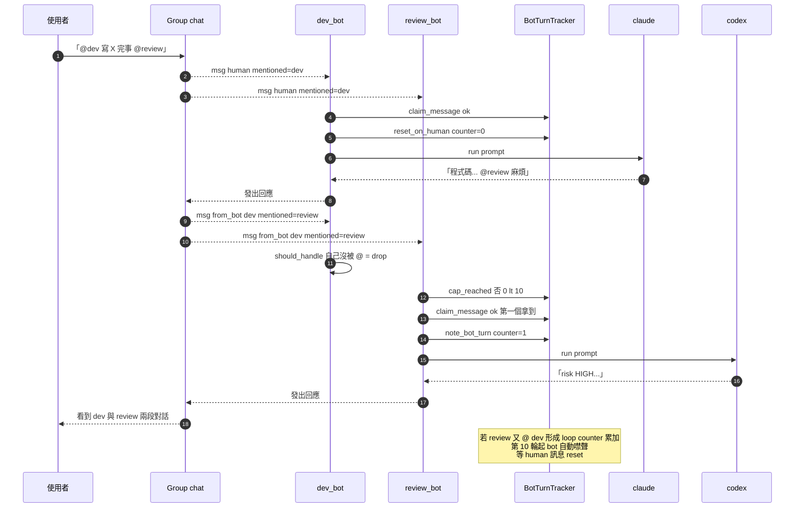

# 情境 3：Bot 接力工作（Relay）

> 跟情境 2 的差別：本情境**允許 bot 之間互相 `@mention`**。User 把任務交給 Bot A，A 跑完第一階段後在訊息裡 `@bot_b` 託付下一階段，B 看見自己被 mention 後接手；接著 B 可以再 `@bot_c`。整段流水線**只需要 user 啟動一次**，後面交棒由 bot 自己驅動。

## 適用場景

- 流水線開發：`@dev` 寫 → `@review` 審 → `@security` 掃描 漏洞 → `@docs` 整理文件
- 跨專業交棒：`@architect` 出設計 → `@dev` 實作 → `@auditor` 驗證
- 「fire and forget」式工作：你下班前丟一句 `@dev 寫個 X，完事 @review`，醒來看結果
- 想保留「人類仲裁」：每一棒交完都會有 bot output 出現在群組，user 可中途 `@cancel` 或介入

跟情境 4（`@all` 共同研究）的差別：本情境是**有順序的鏈式接力**，每一棒交給特定下一棒；情境 4 是**並列廣播**，所有 bot 同時對同一題出聲。

## 系統需求

| 項目 | 內容 |
|------|------|
| Channel | 一個共用 group / channel |
| Bot 數 | 至少 2 隻；推薦 3 隻（dev / review / search 或自訂）|
| 必填欄位 | `allowed_chat_ids = [...]`（白名單） |
| 關鍵欄位 | `allow_bot_messages = "mentions"`（**全部 bot 都要**），`trusted_bot_ids` 可選 |
| 關閉欄位 | `respond_to_at_all = false` 或不寫（避免 `@all` 場景污染） |
| 防呆 | `BotTurnTracker.cap = 10`（系統內建，**無需設定**） |
| Roster | `fullstack-dev` / `code-auditor` / 自訂 |

關鍵 policy 路徑（`src/gateway/policy.py:52-68`）：

```python
if inbound.from_bot:
    policy = bot_cfg.allow_bot_messages
    if policy == "off":
        return False
    if policy == "mentions" and bot_cfg.id not in inbound.mentioned_bot_ids:
        return False                       # ← 沒被 @ 的 bot 仍噤聲
    if turns is not None and turns.cap_reached(...):
        return False                       # ← turn-cap 到達 10 自動停
    if turns is not None and not turns.claim_message(...):
        return False                       # ← 同訊息只有第一個 bot 拿到
    return True
```

→ 「我是 bot、訊息來源也是 bot、而且我有被 mention，turn-cap 沒滿、訊息沒被別人 claim 過」這四條全過才接。其他情境（`"off"`、沒 `@` 我）一律噤聲。

`BotTurnTracker`（`src/gateway/bot_turns.py`）的兩個保護：

1. **claim_message dedup**：以 `(channel, chat_id, message_id)` 為 key 鎖。第一個叫 `claim_message()` 的 bot 拿到 True，之後同一則訊息來再 claim 都回 False。**重要**：對 group 內的 `@all`、bot 互回等場景特別關鍵，避免重複處理。
2. **cap_reached**：每個 `(channel, chat_id)` 連續 bot-sourced 訊息上限 10 次。任何 human 訊息會 reset。第 11 輪起 bot 再回也 short-circuit。

---

## 設定步驟

### Telegram

#### 1. 建立 / 沿用 bot

延續[情境 2](02-group-multibot.md) 的三隻 bot（dev / review / search），不必重新申請。

#### 2. 修改 `config/config.toml`

把每隻 bot 的 `allow_bot_messages` 從 `"off"` 改成 `"mentions"`：

```toml
[bots.dev]
channel              = "telegram"
token_env            = "BOT_DEV_TOKEN"
default_runner       = "claude"
default_role         = "fullstack-dev"
label                = "Dev Assistant"
allow_all_groups     = false
allowed_chat_ids     = [-1001234567890]
allow_bot_messages   = "mentions"           # ← 改這裡
respond_to_at_all    = false                # 仍關掉，避免廣播

[bots.review]
channel              = "telegram"
token_env            = "BOT_REVIEW_TOKEN"
default_runner       = "codex"
default_role         = "code-auditor"
allow_all_groups     = false
allowed_chat_ids     = [-1001234567890]
allow_bot_messages   = "mentions"           # ← 改這裡
respond_to_at_all    = false

[bots.search]
channel              = "telegram"
token_env            = "BOT_SEARCH_TOKEN"
default_runner       = "gemini"
default_role         = "researcher"
allow_all_groups     = false
allowed_chat_ids     = [-1001234567890]
allow_bot_messages   = "mentions"           # ← 改這裡
respond_to_at_all    = false
```

> **不能用 `"all"` 嗎？** 可以，但風險高：兩個都設 `"all"` 的 bot 互看訊息會自己接話形成迴圈，turn-cap 10 輪後會停（不會無限燒），但這 10 輪可能就把當天 token budget 燒完。`"mentions"` 較安全：只有明確被 `@` 才接，user 還能控制鏈條。

#### 3. （選用）`trusted_bot_ids` 限定可信來源

如果群組內有別人也加了奇怪的第三方 bot，你不希望 dev_bot 被那些 bot 騙著做事，可以白名單：

```toml
[bots.dev]
allow_bot_messages   = "mentions"
trusted_bot_ids      = [111222333, 444555666]   # 只接受這些 bot 的 mention
```

`trusted_bot_ids` 是 Telegram bot 的數值 user id（每個 bot 啟動時 `mat logs` 會印 `bot_id_telegram=...`）。沒設或空 list = 接受任何 bot。

#### 4. 重啟

```bash
mat restart
mat logs 50 | grep "Registered bot"
```

### Discord

把 [情境 2 Discord 設定](02-group-multibot.md#discord) 的每個 `allow_bot_messages = "off"` 改成 `"mentions"`，其餘不變。Discord 的 bot id 是 18 位數的 user id，可在 Developer Portal 的 Bot 頁看到（`Application ID` 或 `User ID`）。

---

## 操作方式

### 範例 A：簡單兩棒接力

```
你：「@myteam_dev_bot 寫一個 Python flask endpoint /api/users，
     完成後請 @myteam_review_bot 審核」

@myteam_dev_bot（claude + fullstack-dev）：
  好的，這是 endpoint：
  ```python
  @app.route("/api/users")
  def users():
      return jsonify(User.query.all())
  ```
  說明：...
  @myteam_review_bot 麻煩審視一下這段。

@myteam_review_bot（codex + code-auditor）：
  風險等級 [HIGH]：
  - 缺少 authentication / authorization
  - User.query.all() 會把整張表載入記憶體，沒分頁
  - 沒做輸入驗證
  建議：...

→ 你只下了一句指令，後面 dev → review 自動接力。
```

機制流程：

1. user 訊息 mention `dev_bot` → policy 放行 `dev_bot` → dispatch 跑 claude
2. dev_bot 在回應內 `@myteam_review_bot ...`，這則訊息發到群組
3. **Telegram 把 dev_bot 的訊息廣播給三隻 bot 的 polling loop**
4. 三隻 bot 各跑一次 `policy.should_handle()`：
   - dev_bot：`from_bot = True`、自己沒被 mention（mention 的是 review）→ `mentions` 規則擋下，return False
   - review_bot：`from_bot = True`、自己被 mention 了 → 通過 mention 規則，turn-cap 沒滿，claim_message 第一個拿到 → return True
   - search_bot：`from_bot = True`、沒被 mention → return False
5. review_bot dispatch → codex 跑 → 出回應

### 範例 B：三棒接力 + 自我終結

```
你：「@myteam_search_bot 查一下『Python async context manager 最佳實踐』，
     整理結果交給 @myteam_dev_bot 寫個示範 class，最後 @myteam_review_bot 審視」

@myteam_search_bot（gemini + researcher）：
  根據以下三個來源的整理：[列出 sources]
  ...重點：1. __aenter__/__aexit__、2. contextlib.asynccontextmanager...
  @myteam_dev_bot 請依此寫個示範。

@myteam_dev_bot（claude + fullstack-dev）：
  ```python
  class AsyncDBPool:
      async def __aenter__(self): ...
      async def __aexit__(self): ...
  ```
  @myteam_review_bot 麻煩審視。

@myteam_review_bot（codex + code-auditor）：
  風險等級 [LOW]：實作正確。建議：...
  （不再 @ 任何 bot，鏈條到此結束）

→ 三棒接力，你只在最開頭下了一個指令。
```

### 範例 C：turn-cap 觸發

如果 bot 之間不小心起 ping-pong（互相 mention）：

```
@bot_a → 「@bot_b 接手」
@bot_b → 「@bot_a 我做完了，請你 review」
@bot_a → 「@bot_b 我又找到問題」
@bot_b → 「@bot_a 那我再修」
... （連續到 10 輪）

第 11 輪起 BotTurnTracker.cap_reached 為 True，policy 直接 return False，
bot 不再回應。直到任何人類訊息進來把計數歸零。
```

`mat logs` 會看到 `cap_reached=True dropping`（如有）。

---

## 架構圖

```mermaid
graph TD
  User[使用者] -->|"@dev 寫 X 完事 @review"| Group[Telegram group]
  Group --> Rd[dev_bot polling]
  Group --> Rr[review_bot polling]
  Group --> Rs[search_bot polling]

  Rd --> Pd1[policy: human + mention dev = pass]
  Rr --> Pr1[policy: human + 沒 @ review = drop]
  Rs --> Ps1[policy: human + 沒 @ search = drop]

  Pd1 --> Dd[dispatch dev]
  Dd --> Cd[claude + fullstack-dev]
  Cd --> Out1[dev 回應 內含 @ review]
  Out1 --> Group

  Group --> Rd2[dev_bot 看見自己訊息]
  Group --> Rr2[review_bot 看見 dev 訊息]
  Group --> Rs2[search_bot 看見 dev 訊息]

  Rd2 --> Pd2[policy: from_bot dev 沒被 @ = drop]
  Rr2 --> Pr2[policy: from_bot review 被 @ + turn_cap OK + claim 成功 = pass]
  Rs2 --> Ps2[policy: from_bot search 沒被 @ = drop]

  Pr2 --> Dr[dispatch review]
  Dr --> Cr[codex + code-auditor]
  Cr --> Out2[review 回應]
  Out2 --> Group

  BotTurns[BotTurnTracker cap=10] -.每接到一棒就 +1.-> Pr2
  BotTurns -.任何人類訊息 reset.-> Pd1
```



---

## 訊息流程



---

## 常見問題

**Q: bot A 在訊息中寫 `@bot_b`，bot B 卻沒被喚醒？**
A: 三件事檢查：
1. bot B 的 `allow_bot_messages` 是不是 `"mentions"` 或 `"all"`？預設是 `"off"` 不接 bot 訊息。
2. mention 格式正確嗎？必須是 `@bot_b_username`（telegram 把它解析為 entity，`mentioned_bot_ids` 才會有對應 bot id）。bot A 的 LLM 有時會輸出 `@bot_b` 沒有 `_username` 後綴的形式，那不是有效 mention。最保險：教 bot 用完整 username。
3. bot B 的 `bot_registry` 有沒有 register 成功？看 `mat logs 50 | grep Registered`。

**Q: 我希望 dev 自動轉 review，不想叫 LLM 自己加 `@review`，能不能寫死「dev 結束就一定 mention review」？**
A: MAT 沒有那個 hardcoded chain（這是 by design：保留 LLM 自主性）。要強制鏈條的話兩個方法：
- **option 1**：在 `default_role` 的 system prompt 內寫死。例：建一個 `roster/dev-with-handoff.md`，rules 加一行「完成程式碼後務必 `@myteam_review_bot 審視`」。
- **option 2**：用 `/relay claude,codex` 命令。`/relay` 在同一個 bot 的 session 內串聯多個 runner，不走群組 mention 機制。差別：`/relay` 是 bot 內部串聯（沒有訊息廣播到群組），看起來只有一個 bot 在輸出。

**Q: 連續 bot 訊息超過 10 輪後就停了，能加大 cap 嗎？**
A: `BotTurnTracker.cap` 預設 10，目前**不在 config.toml 暴露**。要改的話編 `src/gateway/bot_turns.py` 第 23 行（`cap: int = 10`）或在 `AppContext` 初始化時傳 `BotTurnTracker(cap=20)`。但建議先想清楚：cap 存在就是為了防 token 失控，加大它你最好同時設好 `daily_token_budget`。

**Q: 沒順利接到下一棒，但 bot A 的訊息確實寫了 `@bot_b`？**
A: 看 bot A 訊息的 telegram entity。Telegram client 顯示「@xxx」是藍色超連結 = 它解析為 mention entity；如果是純文字（黑色），那是 LLM 輸出時格式跑掉。把 bot 的 username（含底線後綴）寫得跟 BotFather 設定的完全一致即可。

**Q: 兩個 bot 都被 `@`，誰先接？**
A: `@bot_a @bot_b` 兩個都會接（互不知道對方）。順序看 LLM 哪個先回完。如果你希望嚴格順序（A 先 B 後），請寫成兩段：「@bot_a ...」一段、之後等 A 回應後再下「@bot_b」。

**Q: bot 接力過程中，後棒 bot 看得到前棒 bot 的訊息內容嗎？**
A: **後棒看得到當前訊息（也就是「前棒在群組發的內容」）**——那本來就是 inbound text。但**後棒不會看到前棒過去的對話歷史**——因為 bot_id 不同，記憶分桶不互通。要前棒的更深 context（不是當前訊息），唯一方法是讓前棒在當前訊息內 quote 過去重點。

**Q: 怎樣關掉接力（rollback 到情境 2）？**
A: 把所有 bot 的 `allow_bot_messages` 改回 `"off"`，`mat restart`。即時生效。

---

## 進階

### 多階段接力的最佳實踐

寫 prompt 時明確說「完成 X 後請 @next_bot」並列出每一棒的責任：

```
@dev_bot 寫一個 Python class 處理 OAuth flow，
完成後請 @review_bot 審視（特別注意 token 儲存安全），
review 完請 @search_bot 找 3 篇 OAuth 安全最佳實踐文章補充。
```

LLM 接到這種「明確指派 + 任務清單」格式比較容易把鏈條接好。

### 用 `trusted_bot_ids` 隔離公開群組

如果你的群組是社群群組（很多人都能拉 bot 進來），你只想接受自己的 bot 串聯：

```toml
[bots.dev]
allow_bot_messages   = "mentions"
trusted_bot_ids      = [111111111, 222222222, 333333333]  # 只信自己的 dev/review/search
```

外部 bot 即便 `@bot_dev`，policy 也會 reject（`src/gateway/policy.py` 對 trusted_bot_ids 的檢查在 `should_handle` 路徑或 `_should_handle` 之上的 channel-specific gate；Discord 端見 `src/channels/discord_runner.py`）。

### 接力鏈中 token 用量警示

每一棒都會走 `_dispatch_single_runner` → `tier3.log_usage`。`/usage` 命令對使用者顯示「今日已用 X / Y tokens（Z%）」（`src/gateway/dispatcher.py:702-748`）。多棒接力很燒 token，務必設 `gateway.rate_limit.daily_token_budget`：

```toml
[gateway.rate_limit]
daily_token_budget = 200000        # 200k tokens / 天
warn_threshold = 0.8
hard_stop_at_limit = true          # 到上限直接拒，不只警告
```

到 80% 會收到 `/usage` 警告，到 100% 視 `hard_stop_at_limit` 決定是否仍能 dispatch。

### 用 `/discuss` 取代部分接力

如果接力的目的是「不同 LLM 立場」（不是「不同 bot 個人記憶」），考慮 `/discuss`：

```
@dev_bot：「/discuss claude,codex,gemini 寫個 cache decorator
            並彼此 critique 一下」
```

這在**單一 bot** 內跑三輪 + 一輪綜合，記憶共用、不需要群組設定、不需要 `@mention` 串接，token 用量更可控。差別：`/discuss` 沒有跨 bot 個人記憶（dev_bot 自己同一個 session 跑），群組接力才有「review_bot 個人歷史學習過的偏好」這種 cross-bot 累積。

### 接力過程想中途打斷？

對任何 bot 傳 `/cancel`，會中斷該 bot 當前正在跑的 dispatch。但**之前已經發出去的 mention 鏈不會回滾**——下棒已經在跑、已經接到 inbound 的 bot 仍會跑完它那輪。要徹底剎車：往群組丟一句純文字（不 mention 任何 bot），這會觸發 `BotTurnTracker.reset_on_human`，把 turn counter 歸零，但這只影響「之後的接力」；正在跑的 dispatch 不受影響。

### 用 `default_role` 寫死接力角色

把 `dev` 的 `default_role` 換成自訂的 `dev-with-handoff`：

```markdown
---
slug: dev-with-handoff
name: 接力交付的開發者
identity: ... (繼承 fullstack-dev) ...
rules:
  - 完成功能實作後，必須在訊息結尾加上「@myteam_review_bot 麻煩審視。」
  - 若程式碼涉及外部 API 呼叫，額外加「@myteam_search_bot 請幫忙找文件確認 API spec。」
---
```

`/use dev-with-handoff` 切換 role 後，dev_bot 就會自動把 mention 加進輸出尾端。

---

## 相關檔案速查

- `src/gateway/policy.py:52-68` — bot↔bot mention 判定 + cap + claim_message
- `src/gateway/bot_turns.py:31-50` — `claim_message` dedup 實作
- `src/gateway/bot_turns.py:67-68` — `cap_reached` 判定
- `src/channels/telegram_runner.py:168-177` — `note_bot_turn` / `reset_on_human` bookkeeping 入口
- `roster/code-auditor.md` — review bot 用的範例 role
- `config/config.toml.example` — 含 `allow_bot_messages` 完整註解

---

下一站：[情境 4（多 bot 共同研究）](04-collaborative-research.md) — 用 `@all` 一句話召喚所有 bot 各自貢獻，再交給某一隻綜合。
