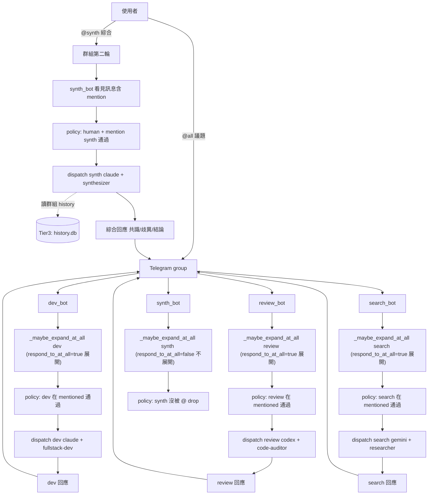
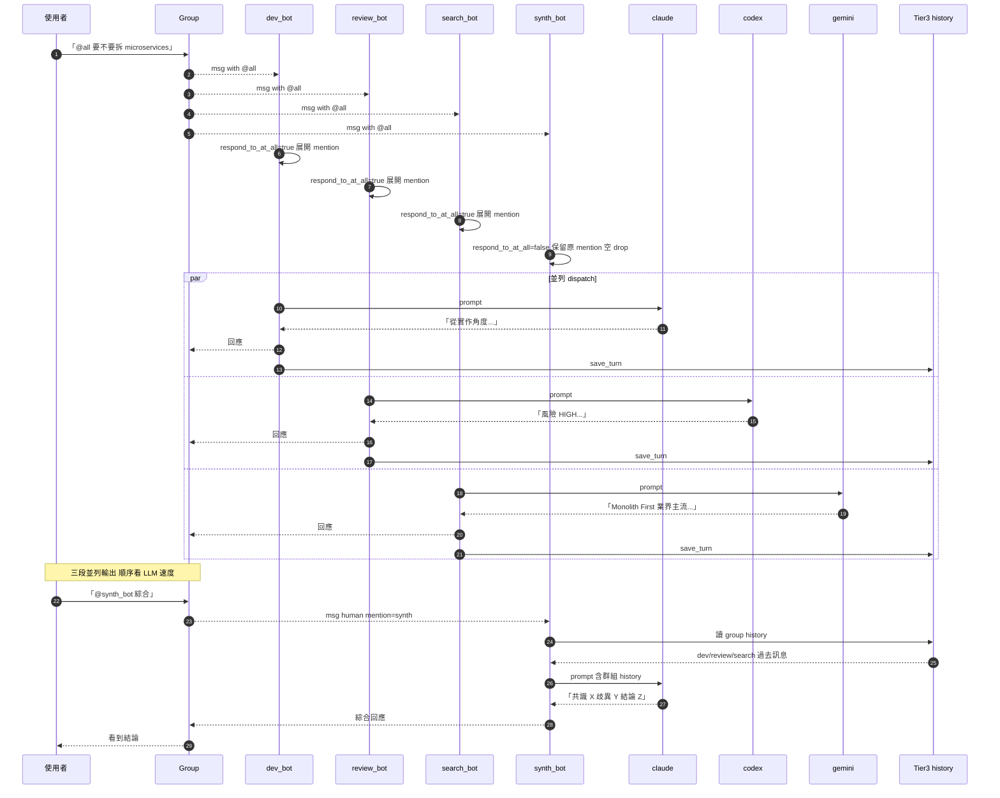

# 情境 4：多 bot 共同研究 + 綜合

> 跟情境 3（鏈式接力）不同：本情境是**並列廣播**。User 用 `@all` / `@大家` / `@everyone` 一句話喚醒群組所有 bot 同時對同一題出聲。然後 user 再對「綜合 bot」（例如 `@synthesizer`）說「綜合上面意見」，由 synthesizer 讀群組 history 整理成統一觀點。

## 適用場景

- 廣徵意見：「`@all` 我們要不要把 monolith 拆成 microservices？」聽 dev、reviewer、researcher 各自視角
- 頭腦風暴：「`@all` 這個產品名稱有什麼可以改進？」
- 多視角確認：要決策前讓 dev / security / business 多角度衡量同一方案
- 比較式研究：「`@all` Postgres vs MySQL 比較」每隻 bot 走不同 LLM 給出獨立答案，再綜合

跟[情境 5（辯論）](05-debate.md)的差別：本情境**追求綜合 / 共識**；情境 5 用不同 role 讓 bot 立場對立、刻意製造張力。

## 系統需求

| 項目 | 內容 |
|------|------|
| Channel | 一個共用 group / channel |
| Bot 數 | 至少 3 隻：N 隻「貢獻者」+ 1 隻「綜合者」 |
| 必填欄位 | `allowed_chat_ids = [...]`、**所有 bot 的 `respond_to_at_all = true`** |
| 關鍵欄位 | `allow_bot_messages = "mentions"`（綜合者要看得到貢獻者的訊息）|
| 關閉欄位 | （無）|
| 系統機制 | `_AT_ALL_RE`（`src/gateway/dispatcher.py:42`）+ `_expand_at_all`、群組 history（綜合者藉此看貢獻者輸出） |
| Roster | `fullstack-dev` / `code-auditor` / `expert-architect` + 自訂 `synthesizer` / `researcher` |

關鍵機制：

1. **`@all` 偵測**：`src/gateway/dispatcher.py:42` 的 `_AT_ALL_RE = re.compile(r"(?<!\S)@(all|大家|everyone)\b", re.IGNORECASE)`。對訊息 text 做 search，命中即觸發。
2. **`@all` 展開**：`_expand_at_all(inbound, registry)` 把 `mentioned_bot_ids` 設為 `registry.all(channel=inbound.channel)`——也就是當前 channel 已 register 的所有 bot id。
3. **per-bot opt-in**：但是 `_maybe_expand_at_all`（`src/channels/telegram_runner.py:84-98`）只在 `bot_cfg.respond_to_at_all == True` 才呼叫展開；否則保留原 `mentioned_bot_ids`。**這是 per-bot 開關**：每隻 bot 自己決定要不要被 `@all` 召喚。
4. **訊息 dedup**：所有 bot 都看到 `@all`，但 `claim_message` 仍以 `(channel, chat_id, message_id)` 為 key——只有第一個叫到的拿 True，其他 return False。**等等，那不就只有一隻 bot 回應？**：對 `@all` 場景特殊，所以 dedup 只在「dispatcher 認為這隻 bot 不該回應」時才生效；`@all` 展開後**每隻 bot 都被視為自己被 mention**，policy.should_handle 各自跑、不互相 dedup（因為 turn-cap 與 claim_message 主要針對 bot↔bot 訊息與群組 human 訊息，這兩個路徑都會走 `should_handle`）。實作細節見「常見問題」。

---

## 設定步驟

### Telegram

#### 1. 沿用情境 2/3 的 dev / review / search 三隻 bot

延續[情境 2](02-group-multibot.md)，三隻 bot + 同一個群組。

#### 2. 多建一隻「綜合者」bot

對 BotFather `/newbot`：username `myteam_synth_bot`、name「Synthesizer」。`/setprivacy → Disable`。把它加進同一個群組。

#### 3. 建立 `roster/synthesizer.md`

repo 內預設沒有此 role，建立：

```markdown
---
slug: synthesizer
name: 綜合者 (Synthesizer)
summary: 讀取多個視角的回答，整理成統一觀點與可執行結論。
identity: 你是一位擅長知識整合的分析師，能讀完多個專家的不同觀點，找出共識、列出歧異，並給出最終建議。
rules:
  - 必須引用每個來源 bot 的關鍵論點（用「dev_bot 認為 X」這種句式）。
  - 明確區分「共識」「歧異」「待釐清」三段。
  - 結論段必須給出可執行的下一步建議。
preferred_runner: claude
tags:
  - synthesis
  - decision
---
綜合者角色，配 claude 適合做整合分析。
```

#### 4. （選用）建立 `roster/researcher.md`

如果你還沒建：見 [情境 2 進階段落](02-group-multibot.md#新增-researcher-角色)。

#### 5. 寫 `secrets/.env`

```env
ALLOWED_USER_IDS=123456789,987654321
BOT_DEV_TOKEN=...
BOT_REVIEW_TOKEN=...
BOT_SEARCH_TOKEN=...
BOT_SYNTH_TOKEN=...
```

#### 6. 寫 `config/config.toml`

```toml
[bots.dev]
channel              = "telegram"
token_env            = "BOT_DEV_TOKEN"
default_runner       = "claude"
default_role         = "fullstack-dev"
label                = "Dev Assistant"
allow_all_groups     = false
allowed_chat_ids     = [-1001234567890]
allow_bot_messages   = "mentions"            # synth 之後會 @ 它
respond_to_at_all    = true                  # ← 開啟：被 @all 召喚

[bots.review]
channel              = "telegram"
token_env            = "BOT_REVIEW_TOKEN"
default_runner       = "codex"
default_role         = "code-auditor"
allow_all_groups     = false
allowed_chat_ids     = [-1001234567890]
allow_bot_messages   = "mentions"
respond_to_at_all    = true

[bots.search]
channel              = "telegram"
token_env            = "BOT_SEARCH_TOKEN"
default_runner       = "gemini"
default_role         = "researcher"
allow_all_groups     = false
allowed_chat_ids     = [-1001234567890]
allow_bot_messages   = "mentions"
respond_to_at_all    = true

[bots.synth]
channel              = "telegram"
token_env            = "BOT_SYNTH_TOKEN"
default_runner       = "claude"
default_role         = "synthesizer"
label                = "Synthesizer"
allow_all_groups     = false
allowed_chat_ids     = [-1001234567890]
allow_bot_messages   = "mentions"            # 看得見 dev/review/search 的訊息
respond_to_at_all    = false                 # 它自己不參與 @all 廣播
                                              # （由 user 單獨 @synth 召喚）
```

> **注意**：`synth` 的 `respond_to_at_all = false`——它不該被廣播觸發，否則它會跟 dev/review/search 同時並列發言。它只在 user 明確 `@synth` 時才回應，並由它自己讀群組 history 寫綜合。

#### 7. 重啟

```bash
mat restart
mat logs 50 | grep "Registered bot"   # 應有四行：dev / review / search / synth
```

### Discord

把 `channel = "discord"`、`allowed_chat_ids = [<discord channel id>]`，其餘照上面 schema。Discord 端的 `@everyone` 是平台原生 special mention（會 ping 所有人）；MAT 仍然用 `_AT_ALL_RE` 對 message text 做 regex match，所以打 `@everyone` 也會觸發 MAT 的 `@all` 邏輯，**但同時也會 ping 整個 channel 的人**——若不想吵到人，建議用 `@all` 或 `@大家`（這兩個沒有 Discord 平台 ping 行為）。

更多 Discord 細節見 [`docs/discord-multi-bot.md`](../discord-multi-bot.md)。

---

## 操作方式

### 範例 A：廣播 + 綜合（最典型）

```
你：「@all 我們的後端要不要從 monolith 拆成 microservices？
     團隊只有 3 個 dev，預計 6 個月發版第一版。」

@myteam_dev_bot（claude + fullstack-dev）：
  從實作角度：
  - 拆 microservices 在 3 人團隊下會變成「每個人輪流維護所有服務」
  - DevOps 成本暴增（CI / 部署 / 監控）
  - 建議：先寫成 well-factored monolith，跑半年再評估...

@myteam_review_bot（codex + code-auditor）：
  風險等級 [HIGH] 對 microservices：
  - 跨服務 transaction 一致性難保
  - 認證 / 授權需重新設計（每個 service 獨立）
  - 資料庫 schema migration 變難
  建議：暫不拆。

@myteam_search_bot（gemini + researcher）：
  根據幾個來源（[ThoughtWorks Tech Radar 2024]、[Martin Fowler MonolithFirst]）：
  - 「Monolith First」是業界主流建議
  - microservices 通常在 30+ engineer 後才必要
  - Conway's Law 提醒組織結構決定架構

（dev/review/search 三隻 bot 並列回應，順序由 LLM 速度決定）

你：「@myteam_synth_bot 綜合上面三位的意見」

@myteam_synth_bot（claude + synthesizer）：
  共識：
    - 三位都不建議當前狀態下拆 microservices
    - 主因：團隊規模小（3 dev）、運維成本暴增、業界主流是 Monolith First

  歧異：
    - dev_bot 強調實作可行性
    - review_bot 強調風險面（transaction、認證）
    - search_bot 提供業界數據（30+ engineer 才必要）

  待釐清：
    - 半年後重新評估的具體 trigger 條件（流量 / 團隊規模 / 業務複雜度）

  結論建議：
    1. 採用 Monolith First，但寫成模組邊界清晰的 well-factored monolith
    2. 設定半年後 review checkpoint，標準：團隊到 8+ dev 才討論拆分
    3. 提前定義服務邊界（領域驅動設計），降低未來拆分成本

→ user 從 4 段對話中拿到「廣度 + 深度 + 整合」三層輸出。
```

### 範例 B：純廣播不綜合

```
你：「@all 給我寫一個 5 字以內的 slogan，主題：跑步鞋」

dev_bot：「Run Light, Run Far」
review_bot：「Step Beyond.」
search_bot：「Born to Run」（致敬 Bruce Springsteen）

→ 不 @synth 就單純收集多個版本，user 自己挑。
```

---

## 架構圖



---

## 訊息流程



---

## 常見問題

**Q: `@all` 哪些 bot 會回？**
A: 「在這個 channel 上 register、且 `respond_to_at_all = true`」的所有 bot。沒設或 `false` 的 bot 不會被叫醒。

**Q: 我打了 `@all` 但只有部分 bot 回應？**
A: 檢查每隻 bot 的 `respond_to_at_all`。**全部都要**設成 `true` 才會反應。漏掉一隻就少一隻聲音。

**Q: `@all` 會不會觸發 dedup 把多隻 bot 砍剩一隻？**
A: 不會。`claim_message` 確實會以 `(channel, chat_id, message_id)` 鎖訊息，但這個鎖只在 `policy.should_handle` 判定「我應該回」之後才呼叫。`@all` 展開後每隻 bot 的 `mentioned_bot_ids` 都包含自己，**human-in-group 路徑**（`policy.py:71-77`）會走進 `claim_message`——這時就會發生「第一個搶到的拿 True，後面的拿 False」。

> **這就是設計上的小坑**：嚴格來說，多隻 bot `@all` 同時搶 `claim_message`，**只有第一隻 return True，其他都 False**——理論上會 drop。

實際 MAT 怎麼讓多隻 bot 都回？因為 telegram polling loop 是 per-bot 獨立的——dev_bot 跟 review_bot 各跑各的 `Application`，**同一則 update 是兩個獨立 webhook payload 進到兩個 polling loop**，雖然 `chat_id, message_id` 相同，但 `claim_message` 是 process 內共用 dict——確實只有第一個拿到 True。

**所以 MAT 對 `@all` 的實際行為是**：第一隻搶到的 bot 回應，其餘 bot drop。這跟一些人預期的「多隻並列回應」**不同**。要讓多 bot 真的同時回應，目前需要：

- 方案 1：在訊息中明確列出每個 bot username，例如 `@dev @review @search 議題...` ——這樣 `mentioned_bot_ids` 直接包含三個 bot id，每隻 bot 走自己的 `should_handle`，**因為 message_id 一樣，dedup 仍會擋掉除第一個外的其他**——所以這方案也不行。
- 方案 2（推薦）：用 `/discuss claude,codex,gemini <prompt>` 命令，在**單一 bot** 內部用三個 runner 接力跑（多輪 + 一輪綜合）。這是 `_dispatch_discussion` 走的路徑（`src/gateway/dispatcher.py:254-358`），不依賴群組多 bot。
- 方案 3（多 bot 真並列）：把多隻 bot 分到**多個群組**（每個群組一隻 bot 為主），user 在每個群組各下一次 prompt 收集答案，最後手動把幾段 paste 給 synth_bot。
- 方案 4（修改 cap，謹慎用）：在 `BotTurnTracker` 加開關讓 `@all` 場景跳過 dedup。目前 repo 沒實作，需自改。

→ **本情境的「多 bot 共同研究」實質上仰賴方案 2（`/discuss`）達成，群組多 bot 並列廣播是部份場景才成立**。請參考下方「進階」段落調整使用模式。

**Q: synth_bot 怎麼讀得到 dev/review/search 的訊息？**
A: 透過 Tier3（SQLite history）。每隻 bot 自己在 dispatch 時把回應 `save_turn` 進 `(user_id, channel, bot_id, chat_id)` 桶。**注意**：synth_bot 自己的 bot_id 是 `synth`，而 dev/review/search 的 bot_id 各不同——synth 直接讀 `bot_id=synth` 看不到別 bot 訊息。

實際 synth_bot 看訊息來源是**telegram 群組訊息流**：`@synth 綜合上面意見` 這則 inbound，telegram 把整段群組 history 都送給 synth 的 polling loop，但 MAT 的 `_build_inbound_from_update` 只取**當前訊息**塞進 inbound text。所以 synth_bot 真要綜合，需要：

- **方法 A**：user 把 dev/review/search 的訊息**手動 quote 或 paste 進** `@synth` 的訊息裡（最可靠）
- **方法 B**：synth 用 `/recall <關鍵字>` 從 Tier3 全文搜尋過去對話（但只看自己 bot_id 的歷史）
- **方法 C**：每個 bot 在自己回應結尾把回應全文 cc 給 synth 的記憶（需要客製 hook，目前 repo 無此機制）

→ **本情境綜合 bot 最簡實作**：user 單手複製 dev/review/search 的回應 → quote 給 synth_bot → synth 直接從 inbound 看到所有 context 做整合。

### 結論：本情境的實際使用方式

考量上述限制，建議用以下兩種模式之一：

#### 模式 A（推薦）：單 bot `/discuss` + 群組廣播協同

- 個人 bot 用 `/discuss claude,codex,gemini <題目>` 收集多 LLM 意見（一個 bot 內全處理，自動含綜合）
- 群組多 bot 場景僅當你**真的需要不同 bot 各自的人格 / 記憶**時才走 `@all` 廣播；單 prompt 多 bot 並列因為 dedup 限制可能只第一個回

#### 模式 B：多群組分散 + synth 整合

- 把 dev / review / search 各自放在**自己專屬的群組**（每個群組就 1-2 隻 bot），user 對每個群組單獨 prompt
- 收集到的回應手動 quote 進 synth bot 的 DM 給結論

---

## 進階

### 用 `/discuss` 取代群組 `@all`

對單一 bot 傳：

```
@my_dev_bot：「/discuss claude,codex,gemini 比較 Postgres 跟 SQLite 適合 3 人小團隊嗎」
```

效果：

1. dev_bot session 內輪流跑 3 個 runner（claude → codex → gemini）
2. 每輪 LLM 看得到上一輪的回答（因為都在同一 session）
3. 最後再跑一輪「綜合」由最後那個 runner 出最終結論
4. 一個 bot、一段 session、token 用量可控

實作走 `_dispatch_discussion`（`src/gateway/dispatcher.py:254-358`），最後自動串綜合。

### `@all` 的安全等級設計

`respond_to_at_all` 是 per-bot 而不是全域開關。建議分級：

```toml
[bots.dev]                    # 主力 bot：總是接 @all
respond_to_at_all = true

[bots.review]                 # 評審 bot：總是接
respond_to_at_all = true

[bots.expensive_bot]          # 高 token 成本（如 claude opus）：選擇性接
respond_to_at_all = false     # 預設不參與廣播
                              # user 要它出聲時用 @expensive_bot 直接 mention
```

### 限制 `@all` 廣播的群組

`respond_to_at_all` 是 per-bot 不是 per-group。如果同一隻 bot 在多個群組（`allowed_chat_ids` 多個），它在每個群組都會接 `@all`。要限制只在某群組廣播，需另外設一隻 bot：

```toml
[bots.dev]                    # 工作群組廣播版
allowed_chat_ids  = [-1001234567890]
respond_to_at_all = true

[bots.dev_quiet]              # 個人群組安靜版（同 token 不行，需另一個 token）
allowed_chat_ids  = [-1009999999999]
respond_to_at_all = false
```

實務上這代表你需要兩個 BotFather bot。

### 用「綜合」prompt 取代 synth_bot

不想多開一隻 bot 的話，user 可以對 dev_bot 直接下：

```
@dev_bot 「請依以下三段意見綜合出共識、歧異、結論：
[paste dev_bot 自己的回答]
[paste review_bot 的回答]
[paste search_bot 的回答]」
```

dev_bot 看 inbound 文字就能整合，無需另一個 bot。差別：少一個記憶分桶（綜合過程留在 dev_bot history）。

### 結合 Tier1 永久事實

廣徵意見之後想把結論寫進永久事實：

```
@my_dev_bot：「/remember 對 microservices 拆分的決策：團隊到 8+ dev 才考慮，半年 review」
```

之後任何 bot 在自己的對話 context 裡都能透過 ContextAssembler 拉到這條 fact（前提是同一 user_id 跟 bot_id；跨 bot 仍隔離，所以建議在每隻 bot 都各自 `/remember` 一次）。

---

## 相關檔案速查

- `src/gateway/dispatcher.py:42` — `_AT_ALL_RE` regex
- `src/gateway/dispatcher.py:71-76` — `_expand_at_all` 展開實作
- `src/channels/telegram_runner.py:84-98` — `_maybe_expand_at_all` per-bot opt-in 包裝
- `src/gateway/policy.py:71-77` — human-in-group 路徑（會走 `claim_message`）
- `src/gateway/dispatcher.py:254-358` — `/discuss` 內建多 runner 整合
- `roster/synthesizer.md` — 自訂綜合者 role（需建立）

---

下一站：[情境 5（多 bot 辯論觀點）](05-debate.md) — 為每隻 bot 設不同立場 role，用 `@all` + 不同 system prompt 製造對立辯論。
